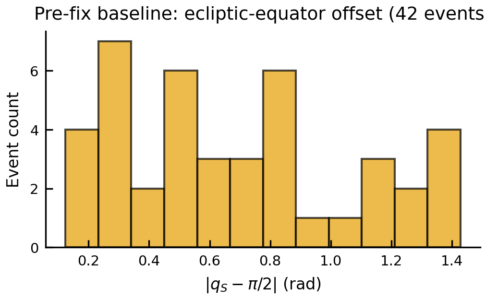

# Coordinate Bug Baseline Audit (Phase 35)

Generated: 2026-04-21T21:42:02.736778+00:00Z
Source CSV: `/home/jasper/Repositories/MasterThesisCode/simulations/cramer_rao_bounds.csv`
Event count: **42**
Git commit: `edd6f03ad7e05f341be5981ac87f67250175a91a`

## Band counts — events within `|qS − π/2| < band × π/180`

| Band | Count | Fraction (observed) | Fraction (isotropic prior) | Deviation |
|------|-------|---------------------|----------------------------|-----------|
| ±5° | 0 | 0.0000 | 0.0872 | -0.0872 |
| ±10° | 2 | 0.0476 | 0.1736 | -0.1260 |
| ±15° | 5 | 0.1190 | 0.2588 | -0.1398 |

## Histogram

## JSON sidecar

`.planning/audit_coordinate_bug.json`

## Summary

Observed fraction in ±5° band minus isotropic-prior expected (0.0872) is -0.0872. A large positive deviation would suggest the coordinate bug is artificially piling events at the ecliptic equator via the singular BallTree embedding (handler.py:286-288). Phase 40 VERIFY-04 re-runs this audit post-fix and diffs the JSON.
