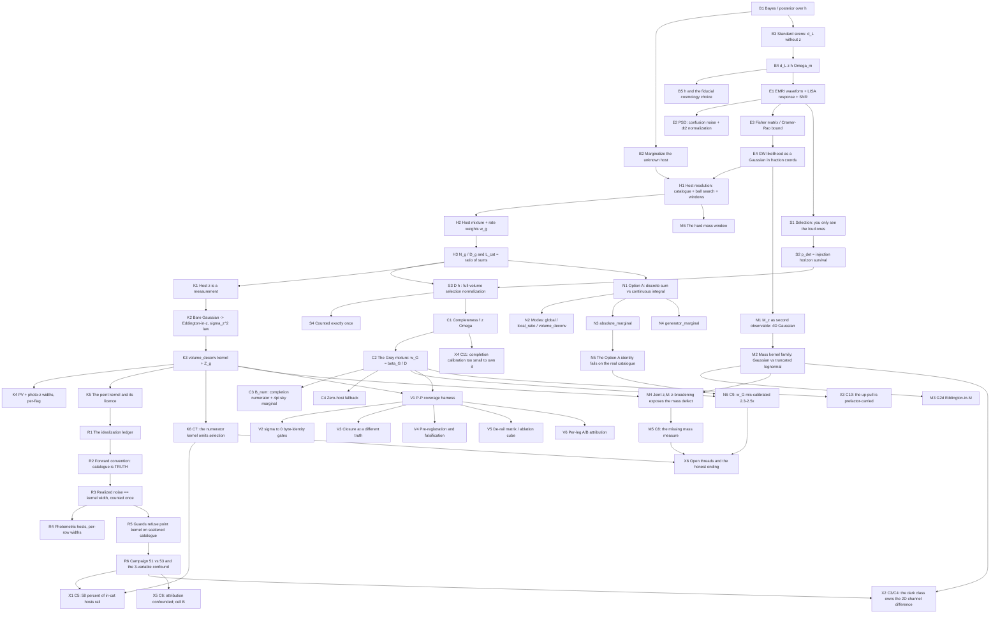

# BOOK_SOURCES_MAP — concept dependency graph, authoritative sources, and defect motivations

**Role:** content cartography for the interactive discovery book. This file is the *substrate*:
every concept the reader must hold, in dependency order, each with (a) its authoritative source,
(b) its code location, (c) its key equation, (d) **the defect or enhancement that motivates it**
— the "what breaks without this" that the book's pedagogy is built on — and (e) the places where
the project's own sources **conflict or have been superseded**.

**Written 2026-07-31.** All paths are relative to `/home/jasper/Repositories/darksiren-emri`
(the read-only source repo) unless marked otherwise. Line numbers are as of the working tree
inspected on this date; treat them as anchors to re-grep, not as immutable.

**Scope boundary.** This is a *map of what is true and where it is written*. The chapter partition
in §6 is a proposal from the graph's own structure; the pedagogy architect proposes independently
and the synthesizer merges.

---

## 0. How to read this map — the trust tiers

The project has an unusually strict epistemic ladder. **The book must respect it**, because the
difference between "ratified" and "measured claim" is exactly the difference between a chapter
that can assert and a chapter that must attribute.

| Tier | Meaning | Book licence |
|---|---|---|
| **RATIFIED** | Author-approved derivation packet with `[RATIFY-*]` gates, dimensional analysis, limiting cases, regression tests. | Assert freely; cite the packet. |
| **CANDIDATE** | Derived and implemented, explicitly *not* established sufficient. **The 2D real-data mode is here** ([RATIFY-M6]). | Must say "candidate"; never present a 2D number as settled. |
| **FINDING (measured)** | Reproduced measurement with provenance, adjudicated. E.g. C1–C5, C7–C11. | Assert the *measurement*; attribute the *interpretation*. |
| **CLAIM (written to be attacked)** | The claim file's own self-description. | Only with its adjudicated verdict attached. |
| **EXONERATED / REFUTED** | Tested and killed. The binding union is `CLAIM_2D_BIAS_20260730.md` "Exonerated" **plus** `BIAS_HISTORY_LEDGER.md` §2 (items 1–17). | The **defect museum**. Never present as live. |
| **[AMBIG] / CONTESTED** | Sources disagree; flagged in §7. | Never state either side without the flag. |

**Standing scoping rule (binding, from the ledger §2):** *negative* conclusions are **venue-scoped**.
`volume_trunc` (#70) and `mass_trunc` (#72) were both falsified on the *same* seed600 494-event
shallow subsample. Do not let a chapter say "X was ruled out" without "…in that venue".

---

## 1. The spine in one paragraph

A gravitational wave gives you a **luminosity distance** but no **redshift**; H₀ needs both
(→ B1–B4). One EMRI compresses to a **Gaussian in fraction coordinates** whose covariance is the
Fisher/Cramér–Rao bound (→ E1–E4). The missing redshift is supplied by **marginalizing over
candidate host galaxies** in a catalogue ball, weighted by an astrophysical rate (→ H1–H3). Because
you only detect loud events, the likelihood must be **normalized by a selection integral** — omit
it and the posterior rails (→ S1–S4). Because the catalogue is **incomplete**, the estimator is a
two-leg **mixture**: a catalogue leg and a completion leg, with weight `w_G = β_G/D` (→ C1–C4).
Because catalogue redshifts are **measurements, not truths**, the per-host z-kernel must be a
posterior, not a likelihood — the `volume_deconv` deconvolution (→ K1–K6). Adding the **BH mass**
as a second observable creates a 2D channel with its own kernel, its own measure, and its own
failure modes (→ M1–M6). What the mixture is normalized *to* is a **choice of estimand** —
`generator_marginal` vs `absolute_marginal` — and they do not agree (→ N1–N6). All of this is only
believable because of the **calibration instruments**: P–P coverage, σ→0 byte-identity, closure at
a different truth, pre-registration (→ V1–V6). Finally, the mock had to be made **honest**: realize
the catalogue's actual measurement noise (→ R1–R6). What that produced is the current, openly
inconsistent state: an in-catalogue rail, a 2D channel owned by the dark class, a reparametrization
dependence, and a mis-calibrated mixture weight (→ X1–X6).

---

## 2. Dependency graph (concept IDs)

---

## 3. Concept cards

Each card: **prereqs · authoritative source · code · key equation · DEFECT/ENHANCEMENT (measured
evidence) · book hook**.

### Tier 0 — Bayesian and cosmological foundations

**B1 — Bayes' rule and the posterior over h**
- Prereqs: none. Source: `derivations/dark_siren_likelihood.md` §1.1. Code: `bayesian_statistics.py:1954 evaluate()`, `bayesian_inference/posterior_combination.py`.
- Eq: `p(h | {x_i}) ∝ p(h) Π_i p(x_i | h, D)`; the pipeline works in `Σ_i ln p_i(h)` on a grid.
- **Enhancement:** working in log-space with an explicit grid is what makes every later diagnostic (per-event Δ ln p, class budgets, nats accounting) possible. **Defect it cured:** naive product underflows — Phases 21–23, "log-space + 4 strategies, fixed, *not* the cause" (ledger #7).
- Hook: the running worked example starts here — one event's `ln p_i(h)` curve, which the reader will watch deform through every subsequent chapter.

**B2 — Marginalizing the unknown host**
- Prereqs: B1. Source: `dark_siren_likelihood.md` §1.2–1.3. Code: `bayesian_statistics.py:2909 p_Di`.
- Eq: `p(x | h) = Σ_g p(g) p(x | g, h)` — the host identity is a nuisance parameter, integrated out, **not** an error bar.
- **Enhancement:** this is the whole dark-siren idea. Without it you need an EM counterpart.
- Hook: predict-then-reveal — "how much does H₀ precision degrade when you don't know the host?" Reader guesses; reveal the 76-in-catalogue vs 1512-dark information split (`IDEALIZED_BASELINE_READOUT.md`: 100% of the constraint from 76 events, 3 loudest carry 46%).

**B3 — Standard sirens: a distance without a redshift**
- Prereqs: B1. Source: Schutz (1986) via `dark_siren_likelihood.md` §2.4; Gray et al. 2020 arXiv:1908.06050.
- Eq: waveform amplitude ∝ 1/d_L ⇒ d_L is directly measured; `H₀ ≈ cz/d_L` needs z.
- Hook: the "aha" of the whole book — slider on z at fixed d_L, watch h move.

**B4 — The distance–redshift relation**
- Prereqs: B3. Source: `dark_siren_likelihood.md` §2.4. Code: `physical_relations.py:132 dist`, `:226 dist_vectorized`, `:447 dist_to_redshift`, `:571 comoving_volume_element`, `:322 dist_derivation`.
- Eq: `d_L(z; h, Ω_m) = (1+z)·(c/100h)·∫₀^z dz'/E(z')`, `E(z) = √(Ω_m(1+z)³ + Ω_Λ)`.
- **Defect (live, LOW):** `physical_relations.py` accepts `w_0`, `w_a` but hardcodes ΛCDM (GitHub #4); guarded by `_reject_unsupported_wcdm` (`:36`). Scope limit, quoted in G7 row 14.
- Hook: interactive `d_L(z)` with h and Ω_m sliders; overlay the degeneracy direction.

**B5 — h, and why the fiducial cosmology is a *choice***
- Prereqs: B4. Source: `docs/gates/G7_systematics_budget.md` row 6; GATE_SIGNOFF G11.
- Code: `constants.py` (`OMEGA_M=0.2726`, `H=0.73`).
- **Enhancement (design choice, not bug):** Ω_m = 0.2726 matches the Barausse (2012, arXiv:1201.5888) M1 EMRI-population cosmology so the mock universe is self-consistent. If truth were Planck 0.3153: +0.3% at z≈0.1 → +3.3% at z≈1.5 on H₀ — **QUOTED**, not absorbed. GitHub #6 closed as design choice (ledger #53).
- **Measured non-effect:** the seed600 Ω_m-era mismatch is −0.00059 in h, *wrong-signed* (ledger #59).
- Hook: "defect museum" candidate that turned out to be a *design choice* — a useful counter-example to the reader's growing "everything is a bug" prior.

### Tier 1 — one event

**E1 — Waveform, LISA response, SNR**
- Prereqs: B4. Code: `parameter_estimation/parameter_estimation.py:335 scalar_product_of_functions`, `:488 compute_signal_to_noise_ratio`; `LISA_configuration.py` (F₊, F×, SSB↔detector).
- Eq: `⟨a|b⟩ = 4 Re ∫ ã(f) b̃*(f) / S_n(f) df`; `SNR = √⟨h|h⟩`; threshold `SNR_THRESHOLD = 20`.
- Hook: the running example's waveform + its SNR; slider on d_L → SNR → detected/not.

**E2 — The PSD: confusion noise and the missing dt²**
- Prereqs: E1. Source: `docs/derivations/G8_dt2_inner_product_derivation.md` (5 evidence lines L1–L5).
- Code: `LISA_configuration.py:_confusion_noise` (Babak et al. 2023 arXiv:2303.15929 Eq. 17).
- **Defect (fixed, spectacular):** the DFT↔continuous-FT convention dropped a `dt²`. Consequence: **SNR was physical/10, CRB σ ×10, and the population depth collapsed to z ≤ 0.11 instead of ≲1.5** (G7 row 1, commit `fcc49c4`, ledger #51). Also `49251f3`: the pre-fix confusion-noise TDI transfer made the detector ~10³× deaf below ~1 mHz.
- **Defect (fixed):** galactic confusion foreground absent from the PSD (Phase 9, ledger #1).
- Hook: **the single best "without this it breaks" figure in the book** — the same population, before and after dt², as a z-histogram. It is also an honesty lesson: a normalization constant changed *what universe the experiment could see*.

**E3 — Fisher matrix and the Cramér–Rao bound**
- Prereqs: E1, E2. Code: `parameter_estimation.py:399 compute_fisher_information_matrix`, `:430 compute_Cramer_Rao_bounds`.
- Eq: `Γ_ab = ⟨∂_a h | ∂_b h⟩`, `Σ = Γ⁻¹`; 5-point stencil derivatives (Vallisneri 2008 arXiv:gr-qc/0703086).
- **Defect (fixed):** O(ε) forward differences → 5-point stencil (Phase 10, ledger #2). **Defect (fixed):** `allow_singular=True` masked κ > 10¹⁴ Fishers whose CRBs were numerical noise — hard gate now skips the event (`d17230d`, G7 row 11, ledger #11). **Defect (fixed):** per-parameter ε (Phase 37 PE-02, ledger #13).
- **Exonerated:** Fisher *frame* mismatch (equatorial CRB vs ecliptic catalogue) — real and fixed in Phase 36 (host recovery 31→38/60; H2 alone moved MAP 0.860→0.730, ledger #12), but the *later* seed400 frame-mismatch hypothesis is a **non-cause; rotating would double-rotate** (ledger #27).
- Hook: an interactive Fisher ellipse in (d_L, M_z) — the reader sees the CRB cross-correlation `proj` that later becomes mass-channel branch (b).

**E4 — The GW likelihood as a Gaussian in fraction coordinates**
- Prereqs: E3. Source: `dark_siren_likelihood.md` §2.1, §7.3, §9.1; `docs/derivations/G2a_...md` §1.
- Code: `bayesian_statistics.py:1856 _mvn_pdf`, `:3532 single_host_likelihood`, 4D path `:4014 single_host_likelihood_batch`.
- Eq: 3D `x = (φ, θ, d_L/d_L^det)` with mean `(φ_det, θ_det, 1)`; 4D adds `M_z/M_z,det`. Conditional-Gaussian marginalization over `M_z` via Bishop (2006) Eqs. 2.81–2.82.
- **Enhancement:** fraction coordinates make the GW leg h-independent and put all h-dependence in `d_L(z;h)` — this is what makes the per-event `ln p_i(h)` curve interpretable.
- **Defect (fixed):** the "Gaussian evaluation index bug (3D vs 4D)" was investigated and found **NOT A FACTOR** (ledger #4) — a museum piece about a plausible bug that wasn't one.
- Hook: notation tooltip anchor — every symbol in the book's master equation should hover-link back here.

### Tier 2 — from one event to H₀

**H1 — Host resolution: catalogue, ball search, candidate windows**
- Prereqs: B2, E4. Code: `galaxy_catalogue/handler.py:505 setup_galaxy_catalog_balltree`, `:519 get_possible_hosts_from_ball_tree` (**z filter at `:584-592`, mass filter at `:594-603`**), `:621 setup_4d_galaxy_catalog_balltree`.
- Eq: candidates = BallTree ball of radius set by the GW localization; **1D uses the z filter only; 2D adds the mass window**.
- **Load-bearing structural fact for the whole book:** *the 1D channel never sees the mass window* (`handler.py:592` vs `:605`). The claim file records this as **error #2 of that session** — "the 'why is 1D spared?' screen has no discriminating power for mass hypotheses".
- **Defect (fixed):** the ecliptic/equatorial frame migration (Phase 36 + 43-H2), ledger #12 — the *primary mover* of its era.
- Hook: "break it yourself" sandbox — shrink the ball radius, watch true hosts fall out and impostors dominate.

**H2 — The host mixture and the rate weight**
- Prereqs: H1. Source: `G2c_gray_a9_a10_mapping.md` §2 (row `w_g`), deviation **D1**.
- Code: `bayesian_statistics.py:879 _rate_weight`.
- Eq: `w_g = R_eff(M_g)/(1+z_g)` — per-MBH EMRI rate (Babak et al. 2017 arXiv:1703.09722) × detector-frame time dilation.
- **Enhancement:** this is *the same weight the generator uses* to draw hosts (`handler.py:765 draw_rate_weighted_hosts`) — the simulation/inference loop is closed by construction. Gray's placeholder luminosity weight (A3/A4) is replaced by astrophysics.
- **Documented approximation:** `w` is evaluated at the catalogue `z_g` and pulled *outside* the `∫dz`, whereas Gray (A10) has `p(s|z_i)` inside — "second-order for narrow σ_z but **not** for GLADE+ photo-z widths — undocumented approximation" (G2c D1 sub-deviation). **Flag for the book: this is an honest, still-open approximation.**
- Hook: slider on the R_eff slope; watch which candidate host wins the ball.

**H3 — `N_g`, `D_g`, and `L_cat` as a ratio of sums**
- Prereqs: H2, S2. Source: `G2c` §2 (rows `N_g`, `D_g`, `weighted_ratio_of_sums`), §4.
- Code: `bayesian_statistics.py:804 weighted_ratio_of_sums`, `:855 weighted_sum`, `:3532 single_host_likelihood`, numerator `:3722`, denominator `:3742`.
- Eq: `L_cat = Σ_g w_g N_g / Σ_g w_g D_g`, `N_g = ∫ N₃(...) p_g(z) dz`, `D_g = ∫ p_det(d_L(z,h), Ω_g) p_g(z) dz`.
- **Defect (fixed, and later *reversed*):** Phase 38's `L_cat` reformulation (ledger #14) was **later found to be a misreading** of Gray Eqs. 24–25; the real fix landed 2026-06-19/20 (`816f904`): ratio-of-sums + p_det **denominator-only**, matching Gray A.9/A.10 — measured **1D 0.750 → 0.740 (bias halved)**, 2D 0.7375 → 0.7350 (ledger #26).
- **Museum piece:** "mean-of-ratios vs ratio-of-sums" is a beautiful, small, checkable defect.
- Hook: toggle mean-of-ratios ↔ ratio-of-sums on the running example.

### Tier 3 — selection

**S1 — You only see the loud ones**
- Prereqs: E1. Source: Mandel, Farr & Gair (2019) arXiv:1809.02063; `G2c` D3.
- Eq: the observed likelihood is `p(x|h)/p(D|h)`; the denominator is the selection integral.
- **THE defect that motivates the whole tier, with the project's own number:** with a *local-window* `L_comp` denominator the MAP sat at **0.60** with bias **−17.8%**; replacing it with the **full-volume D(h)** integral moved MAP to **0.73, bias 0.0%** (Phase 32, ledger #9, `H0R:1980`). This is the single cleanest "without this the posterior is defective" demonstration in the repo.
- Hook: **predict-then-reveal.** Show the un-normalized posterior railing at the prior edge; ask the reader where the missing physics is; reveal D(h).

**S2 — `p_det` as a detection-horizon survival function**
- Prereqs: S1. Source: `simulation_detection_probability.py` module docstring (Finn & Chernoff 1993; Finn 1996; MFG 2019). Code: `bayesian_inference/simulation_detection_probability.py`.
- Eq: `d_hor,k = SNR_k · d_L,k / SNR_thr` (h-invariant!) ⇒ `p_det(d_L) = P(d_hor ≥ d_L)`.
- **Enhancement (the elegant one):** because the amplitude scales as 1/d_L, the horizon set is *independent of the trial h* — the survival grid is built once and reused for every h. This is worth a whole interactive.
- **Defect history (rich museum shelf):** KDE p_det → importance sampling (Phase 11.1, ledger #3); `fill_value=0.0 → None` (v1.4 `44d5358`, −9.2% → −6.9%, ledger #8); h-dependent zero-fill cutoff `c₀ ∝ 1/h` (Phase 44: cluster 0.860 → 0.7650, ledger #16); principled monotonic bridge below `d_L,min` (`2b33cad`, 1D closed at 0.7309, ledger #21); kernel tail-overshoot → survival estimator (`5e94139`: D(h) decline −3.9% → −0.87%, 1D 0.760→0.750, ledger #33).
- **Exonerated (do not re-open):** p_det grid resolution 30 vs 60 (#10); the first-bin asymptote / anchor escalation — **+12% lift moved the MAP by exactly zero grid steps** (#17, the best "wrong layer" lesson in the project); NW vs LL estimator choice — bias-neutral (#34); adding `p_det` inside the numerator alone — refuted *and it breaks calibrated controls* (#66).
- Hook: interactive survival curve built from the actual injection pool (`injection_pool_mix200k_20260728`, 200,807 rows, z_cut 1.5; fingerprint `dl_max(0.73)=9.164987 Gpc`).

**S3 — `D(h)`: the full-volume selection normalization**
- Prereqs: S2, C1. Source: `G2c` §2 row `D(h)`; **citation correction C2 in `G2c` §6**.
- Code: `bayesian_statistics.py:1013 precompute_completion_denominator` (D(h)), `:1170 precompute_missing_completion_denominator` (β_Ḡ), β_G = D − β_Ḡ.
- Eq: `D(h) = ∫ ⟨p_det(d_L(z,h),Ω)⟩_Ω · (dV_c/dz dΩ) · dz/(1+z)`, units Mpc³ sr⁻¹.
- **Documentation defect (flag for the book):** the docstring cites "Gray Eqs. 33 / A.19"; it is actually the **denominator of (A14)**. `G2c` §6 C2. Do not propagate the wrong citation.
- Hook: the D(h) curve, and the reader's ability to break it by truncating the volume.

**S4 — Counted exactly once**
- Prereqs: S3. Source: `G2b` §3.2 ("the `dV_c` counted once" rule); `G6_starvation_postmortem.md:24-33`.
- **The governing principle of the whole estimator**, and the book should name it early: every physical weight (volume prior, rate weight, p_det, mass prior) must appear in numerator and denominator **exactly once**.
- **Defect (fixed):** `D(h)` was double-counted (inside `L_comp` *and* as an outer `−N log D`) — `6754ddb`, eliminated +0.020…+0.025 (ledger #20). **Defect (fixed then reversed):** Phase 43-H1 *added* a missing `−N log D` to `extract_baseline` and it was later found **actively harmful** (ledger #15, #17).
- **The overturn worth telling:** the project once concluded "in-catalogue photo-z dark sirens are **information-starved**" (ledger #41). That verdict was **OVERTURNED** (#52): starvation is "a property of prior-INCONSISTENT estimators, not of the data"; the cure is consistency — counted exactly once.
- Hook: a "counted-once ledger" widget the reader fills in per term; mis-fill it and watch the bias appear.

### Tier 4 — incompleteness and the mixture

**C1 — Completeness `f(z, Ω)`**
- Prereqs: S3. Source: `G2c` deviation **D2** (Gray–Messenger–Veitch 2022 arXiv:2111.04629 Eq. 5; Gray 2023 arXiv:2308.02281 Eq. 2.3).
- Code: pixel completeness cache `pixel_completeness.py` (shape `(npix,)`, built from apparent B magnitudes, **no z binning** — redshift enters at query time via the distance modulus).
- Eq: Gray's hard `Θ[m_th − m]` + Schechter integrals are pre-integrated into a smooth completeness fraction `f`.
- **Enhancement:** smoothness is what makes the completion leg differentiable in h and computable per pixel.
- **Known regime fact:** GLADE completeness at z ≳ 0.3 is *forecast-defining* after the dt² fix deepened the population (G7 row 15).
- Hook: sky map of `f`, with a z slider.

**C2 — The Gray mixture and `w_G`**
- Prereqs: C1, H3. Source: `G2c` §1 (the identity), rows `beta_G`, `beta_Gbar`, `w_G`; Gray et al. 2020 Eqs. (9), (A14), (A15), (A19).
- Code: assembly at `bayesian_statistics.py:3309-3311`:
  `w_G = beta_G / D_h`; `combined_without_bh_mass = (beta_G * L_cat_without_bh_mass + B_num) / D_h`.
- Eq: `p_i = w_G L_cat + (1 − w_G) L_comp`, `w_G = β_G/D`, `L_comp ≡ B_num/β_Ḡ` (diagnostic only; the single-ratio form is algebraically identical and numerically safer as f→1 — deviation **D4**).
- **Enhancement:** the mixture is *why a dark siren works at all when the catalogue is incomplete*.
- **Verified to machine precision:** the mixture identity holds to 2.8e-16 on 65,108 rows (`HANDOFF_20260730.md` §2; re-verified 3.9e-13 / 9.2e-13 in Gate B).
- Hook: **the master interactive of the book** — two legs, one slider (`w_G`), the reader watches the combined MAP move between the catalogue leg's argmax and the completion leg's argmax. This single widget carries Chapters 5, 8, and 11.

**C3 — `B_num` and the 4π sky marginal**
- Prereqs: C2. Source: `docs/derivations/G2a_completion_sky_marginal_4pi.md` (§3 exact factorization, §5 the sinθ measure, §7 limiting cases).
- Code: `bayesian_statistics.py:3210-3238` (B_num integrand).
- Eq: `B_num = ∫ (1−f_k(z)) · (1/4π) · N(d_L(z,h)/d_L^det; 1, σ_marg) · (dV_c/dz dΩ) dz/(1+z)`.
- **DEFECT (fixed, dramatic):** the completion term was evaluated at the **peak sky density** instead of the isotropic marginal, and the `sinθ_det` solid-angle Jacobian was missing. Consequence: **~5000× `B_num` inflation → the posterior railed at the grid edge**. Fixed by `cb16142` (1/4π marginal) + `4a259b7` (sinθ; median 1.15×, mean π/2 over-weight). G7 rows 3–4; ledger #46.
- **Deviation D5 (open, honest):** the sky treatment is *mixed* — the GW likelihood is marginalized against 1/4π while incompleteness is delta-collapsed to the event pixel. Exact only if `f` is constant across the GW sky support. Maps to no single published equation.
- Hook: a sky-integral visualizer: peak-evaluate vs marginalize, with the 5000× on a log axis.

**C4 — The zero-host fallback**
- Prereqs: C2. Source: `H0R:1368-1420`; `G2a`/issue #29; `DERIVATION_GENERATOR_CONSISTENT_NORM.md` §4.1.
- Code: `bayesian_statistics.py:2832-2844` (pure-completion `p_i = B_num/D`), `:3279-3280`.
- **Defect (real bug, fixed `8db6c6e`):** events with zero catalogue candidates were **silently dropped** — 58% of events on the deep venue (ledger #54).
- **…and the fix did NOT clear the rail** (ledger #55, EXP-40): rail persists at 0.6000 in both channels; fallback events are **h-inert (−59 nats)**. A perfect two-part museum exhibit: a real bug whose repair changed nothing about the symptom.
- **And the estimator it installs is itself biased:** the pure-completion fallback is **BIASED HIGH** at deep incompleteness, +0.7…+5.4% in h, cov68 ≤ 0.27 at comp_frac 0.22–0.85 (ledger #57).
- Hook: interlude — "fixing a real bug is not the same as explaining the symptom."

### Tier 5 — host-redshift kernels

**K1 — The catalogue redshift is a measurement**
- Prereqs: H3. Source: `hostz_pv_photoz_kernel.md` §0–§1; `realistic_host_observation_model.md` §3.1.
- Eq: `p(z_true | z_obs) ∝ N(z_obs; z_true, σ) · p_pop(z_true)`.
- Hook: the pivot of the book's second half. Reader is asked to state, in their own words, why `N(z; z_g, σ)` is *not* that object.

**K2 — Eddington-in-z and the σ_z² law**
- Prereqs: K1. Source: **`G2b_host_z_volume_prior.md` §2.1–2.3** (RATIFIED).
- Eq: `δz_Edd = σ_z² · d ln w_pop/dz`, propagating to `Δh ≈ −h · (d ln f/dz) · σ_z² · s(z̄) ≡ −C(z̄) σ_z²`, with `s(z) = 2/(I E) − E'/E − 1/(1+z)`.
- **DEFECT (fixed, and the cleanest quantitative law in the project):** the bare Gaussian omits the `+σ_z² s` shift ⇒ H₀ biased **low**. Measured: `Δh = −0.0016 / −0.0064 / −0.023 / −0.046` at `σ_z = 0.005 / 0.015 / 0.035 / 0.050`; floor-subtracted ratios 1 : 4.8 : 10.0 vs σ_z² = 1 : 5.44 : 11.1 (**law holds to ~10%**); `C_meas ≈ 17–20` constant to ±8% across a factor 11 in σ_z². Coverage collapses to **≈0%** with the bare kernel and returns to nominal with the volume kernel (G7 row 2, ledger #47).
- Hook: **the flagship interactive of Chapter 6.** σ_z slider; the reader sees the −Cσ_z² parabola *and* the coverage bar collapse in the same widget.

**K3 — The `volume_deconv` kernel**
- Prereqs: K2. Source: `G2b` §1, §3; `G2c` §4.3 (deviation **D8** — no Gray equation prescribes this).
- Code: kernel at `bayesian_statistics.py:3712 galaxy_redshift_prior_pdf`; batched at `:4202 _z_prior_pdf_at`, `w_pop` construction `:4190-4199`.
- Eq: `p_g(z) = N(z; z_g, σ_z) · w_pop(z) / Z_g`, `w_pop = (dV_c/dz)/(1+z)`.
- **Enhancement:** the same population prior that `D(h)`, `β_Ḡ` and `B_num` carry — "counted once" in z.
- **Verified properties:** exactly h-invariant (`Z_g ∝ h⁻³` to 1e-15, ledger #75); σ_z→0 recovers the point kernel; kernel h-invariance re-measured 9.1e-16 in Gate B.
- **⚠ CONFLICT with C7 — see §7 item 1.** G2b *ratifies* `w_pop` **without** `p_det`, calls it "the unique weight consistent with the project's own rate model and with every selection integral", and protects its h-independence with a **binding regression gate** (`G2b:413-436`; `PRODUCTION-KERNEL-FIX-SCOPING:170-180` gate 6). C7 measures that the same kernel inflates the recovered h. **No chapter may present either as settled without the other.**
- Hook: side-by-side kernels (bare / volume / point) on one host; then the reader tries to break each.

**K4 — Peculiar velocity and photo-z widths**
- Prereqs: K3. Source: **`hostz_pv_photoz_kernel.md`** (RATIFIED 2026-07-26, gates 1–5). Literature table verified: Laghi et al. 2021 arXiv:2102.01708; Turski et al. 2023 arXiv:2302.12037; GLADE+ Dálya et al. 2022 arXiv:2110.06184.
- Eq: `σ_z,tot² = σ_meas² + ((1+z)σ_v/c)²`; corrected hosts σ_v = 150 km/s, uncorrected σ_v = 500 km/s (replacing a 0.0015 fill). PV (1+z) factor: Davis et al. 2011 arXiv:1012.2912.
- **Defect motivating it (measured):** vs the retained `σ_dL/d_L = 0.54%`, PV at 200 km/s is **1.25% median (2.3× larger)** and the GLADE+ parse-time z-floor 0.0015 is **2.67% median (4.9× larger)** — i.e. the *neglected* host-z terms dominated the *retained* GW term. Restoring them degrades the golden-set width ×3.3 (PV) to ×6.8 (PV + floor).
- **Counted-once implementation decision:** PV is applied at **parse time**, folded into the stored `z_error`; the runtime `SIGMA_V_PEC_KM_S` quadrature was removed (single application site).
- **Anti-anchor (museum):** a secondary review attributed `σ_z = 0.013(1+z)³` to Gray et al. — **rejected**; it exactly matches this repo's own dead code `datamodels/galaxy.py:66` (GitHub #7). A lovely cautionary tale about citation laundering.
- Hook: the reader compares GW distance precision against host-z precision — and discovers the bottleneck is not the detector.

**K5 — The point (δ) kernel and its licence**
- Prereqs: K3. Source: `realistic_host_observation_model.md` §3.1–3.2 (RATIFY-R3); `DERIVATION_GENERATOR_CONSISTENT_NORM.md` §4.3.
- Code: `bayesian_statistics.py:112 resolve_host_z_kernel`, `:273 validate_scatter_guards`, point path `:3496-3511`.
- Eq: `N_g = lim_{σ→0} N_g(σ)` — the δ-kernel is *exact* when the generator draws hosts at their catalogue z verbatim.
- **The key epistemic point of the whole book:** the point kernel is **generator-exact for the mock and wrong for real data**. "The δ-kernel is not 'optimistic' under scatter, it is wrong."
- **Measured leverage:** in the three-way per-leg A/B the δ-kernel carries **85.3% (1D) / 86.7% (2D)** of the total ln movement (ledger #88).
- Hook: predict-then-reveal — "the mock recovers truth to −0.24σ. Is that evidence the estimator works?" (Answer: no. It is a *consistency test*.)

**K6 — C7: the numerator kernel omits selection**
- Prereqs: K3, X1. Source: `CLAIM_2D_BIAS_20260730.md` C7 (**FINDING, MEASURED**) + `gate_b_20260730/C7_README.md`.
- Code: `bayesian_statistics.py:4190-4207` (`w_pop_num`, `_z_prior_pdf_at`) — weights the numerator kernel by the *cosmic* prior with **no `p_det` and no catalogue selection φ_cat**.
- **Corrected law (Gate B supersedes the claim's own formula):**
  `h_eff/h_true = [1 + √(1 + 12(σ_z/z)²)]/2 → 1 + 3(σ_z/z)²`.
  The claim's `[1+√(1+8ε²)]/2 → 2ε²` **understates by 1.35–1.5×**. At σ_z/z = 0.25–0.49 the inflation is **+16% to +49%**, `h_eff` 0.85–1.11. **Rail threshold σ_z/z > 0.256.**
- **Measured, not predicted:** point kernel peaks at exactly h_true = 0.730000 for all 76 hosts; `volume_deconv` peaks at 0.7511 / 0.7761 / 0.8476 / 0.9390 for σ_z/z = 0.10 / 0.15 / 0.25 / 0.35. Driver validated against `fixed_quad` at **0.0e0**; no quadrature aliasing. σ_z→0 gate PASSES (log-log slope 1.99, coefficient → 3).
- **Confronted with production:** observed in-cat ball-numerator tilt median **+0.308 nats (93.2% positive)** vs predicted +0.33…+0.39 — against **−408 nats, 0% positive** for the point kernel.
- **Scope narrowed, twice (do not over-claim):** (i) `prior_num` multiplies **both** channels ⇒ C7 is **not** a candidate for the 2D-minus-1D difference; (ii) it acts **against** the dark rail (K > 1 always; dark hosts sit at σ_z/z ≈ 0.10, K = 1.03). The dark catalogue leg's preference for 0.60–0.64 needs `z_g/ẑ ≤ 0.83` ⇒ **foreground contamination — a NEW OPEN THREAD, not a measurement.**
- Hook: the reader drives the kernel themselves at their own σ_z/z and finds the 0.256 threshold.

### Tier 6 — the mass channel (2D)

**M1 — `M_z` as a second observable**
- Prereqs: E4. Source: `dark_siren_likelihood.md` §7–§11; `G2c` deviation **D6** (no Gray analogue).
- Code: 4D path `bayesian_statistics.py:4014 single_host_likelihood_batch`, numerator mass factor `mz_integral` (`:4363-4370`), denominator `:3362 _bh_mass_denominator_inner_m_integral`.
- Eq: `M_z = M(1+z)`; conditional-Gaussian marginalization (Bishop 2.81–2.82), internal Eqs. 14.21–14.33.
- **Defect (fixed):** a spurious `/(1+z)` Jacobian in the with-BH numerator (Phase 15, ledger #5). **Defect (fixed, 20×):** the numerator queried the *observation* `_det_M` instead of the *hypothesis* `host_M(1+z)`, and the grid M-axis mixed source- and observer-frame — Option A observer-frame fix `f01595c`: 2D bias +0.0141 → +0.0007 (ledger #22).
- Hook: the reader adds the mass axis to the running example's Fisher ellipse and watches the 2D posterior appear.

**M2 — The mass kernel family**
- Prereqs: M1. Source: **`mass_marginal_2d_kernel.md`** (RATIFIED 2026-07-27, gates M1–M7; **but see M6/RATIFY-M6 below**).
- Code: production Gaussian `bayesian_statistics.py:3473-3488`; candidate truncated-lognormal family `:537 _mass_trunc_lnM_weight`, `:569 _mass_trunc_sigma_lnM`, `:631 _mass_trunc_mz_integral`.
- Eq (M1 kernel): `LN(M; M_g, σ_lnM) · R_eff(M)`, truncated + renormalized on `[10⁴, 10⁷] = ParameterSpace.M`, flat-in-lnM reference measure.
- **DEFECT motivating it (measured):** the production kernel is an **untruncated linear Gaussian** at σ_lnM ≈ 0.58 (Reines & Volonteri 2015 arXiv:1508.06274, 0.24 dex intrinsic dominant). At σ_M/M = 0.6: **P(M < 0) = 4.8%**; 29% of kernel mass below M_min for low-mass hosts; 24% above M_max for high-mass hosts — and **65% of R_eff-weighted EMRI hosts sit in the M_max boundary zone**.
- **Controlled toy (sign HIGH, ~3σ, all leverages):** production − correct = +0.0004 / +0.0025 / +0.0081 / +0.0165 / +0.0214 at σ_z/z = 0.05 / 0.15 / 0.30 / 0.50 / 0.75.
- **⚠ EXONERATED as the *driver* (twice, do NOT re-derive):** pipeline A/B Δ2D = **+0.0029, wrong sign** (ledger #72), and the ratified-kernel 4-cell A/B moved the 2D by only **−1.8…−2.3 ln of a +25.6…+29.1 excess, MAP unmoved at 0.80** (ledger #89). The kernel is **NECESSARY, NOT SUFFICIENT**.
- Hook: "necessary but not sufficient" is a subtle idea; give the reader the A/B themselves.

**M3 — G2d: Eddington-in-M**
- Prereqs: M2. Source: **`G2d_host_mass_rate_prior.md`** (RATIFIED). Code: `bayesian_statistics.py:500 eddington_shifted_host_mass`.
- Eq: `p_g(M) = N(M; M_g, σ_M²) R_eff(M)/Z_M`; log-linear form gives `M_g^eff = M_g(1 + α_g σ_rel²)`.
- **Implementation correction worth its own museum plaque:** the tilted-Gaussian (log-linear) form **fails** at GLADE σ_rel ≈ 1 near the `kappa_cap` roll-off where R_eff *rises* with M — the local slope gets the shift's **sign wrong** (M_g=10⁵, σ_rel=0.55: slope says down, exact posterior mean moves **UP ~+3.7%**). The shipped form is the **exact moment-matched posterior mean** by 401-point quadrature, pinned against an independent 20001-point quadrature to <0.5%.
- **⚠ STALE CODE COMMENT:** `bayesian_statistics.py:2400-2401` records the 2D effect as −0.020; it was **re-measured post-`713fbd1` at only −0.0022** (ledger #50).
- Hook: the sign-flip is a perfect "your linearization lied to you" interactive.

**M4 — Joint (z, M): why z-broadening exposes the mass defect**
- Prereqs: M2, K3. Source: `mass_marginal_2d_kernel.md` §3.5 (Eq. **M9**).
- Eq: `d ln mz/dz = [d ln p_g/d ln M](M*) · (d ln μ_cond/dz − 1/(1+z)) − 1/(1+z)`; shift `δz ≈ σ_w² Δ′(z_g)`.
- **The mechanism the book needs:** under the point kernel, z is pinned and the mass kernel's *shape* is never swept — defects are invisible (Cell C: 2D at truth). Under a broadened kernel, `M*(z) = μ_cond(z)·M_det/(1+z)` sweeps **through** the kernel's shape, and `mz(z)` becomes a **second z-likelihood**. Mass appears only in the 2D channel ⇒ the defect is 2D-only, which is exactly the observed info-monotonicity violation (2D +0.025 > 1D +0.013).
- **Open first-order caveats [RATIFY-M7]:** GLADE+ stellar masses are luminosity-derived at a fixed fiducial cosmology ⇒ `δ ln M_BH ≈ 2.1 δ ln d_L`, so (a) **(z,M) covariance for photo-z hosts fails at first order**, and (b) the *datum* `M_g` has a hidden h-dependence, `δ ln M_g` up to ≈0.4 across the h-grid — comparable to σ_lnM = 0.58.
- Hook: the "aha" that the mass channel is not an independent extra measurement.

**M5 — C8: the missing mass measure (a well-posedness failure)**
- Prereqs: M4, C2. Source: `CLAIM_2D_BIAS_20260730.md` C8 (**FINDING**) + `gate_b_20260730/README_C8.md`.
- **Measured:** rescaling the mass coordinate by a constant C walks the 2D MAP: **C=1 → 0.81329, C=0.3 → 0.78107, C=0.1 → 0.74440, C≤0.01 → rails at 0.600**; the **1D channel is bitwise invariant**; sensitivity **d(MAP₂D)/d ln C = +0.031 per e-fold**. Reconstruction gate: max |Δ ln P| = **3.6e-12 nats** over all 41 h.
- **The cause is NOT what the claim said.** Refuted: "4D numerator vs 3D `D(h)`". `D`, `β_G`, `β_Ḡ` and `Σ_glob(with_bh)` are **all mass-dimensionless** (correctly — an MFG selection probability). The mismatch is **between the two numerator legs**: the 2D catalogue leg carries exactly one mass density (`mz_integral`), the completion leg carries **none**.
- **The open question is answered:** the code silently hard-wires the measure to `dM_z / M_z,det,i` — *the event's own measured detector-frame mass* (span 1.33e5–1.63e6 M☉, factor 12). A *consistent* physical unit change M → kM is exactly invariant; the pathology is the per-event arbitrary scale.
- **Canonical fix, priced (indicative, NOT ratified):** give the completion leg its missing dark-host mass likelihood `g_i(z)`. `g_frac` median 0.135 ⇒ the completion leg is currently **over-weighted ~7.4×**. Decomposition: h-frozen measure fix moves 2D **0.8133 → 0.7558 (−0.058)**; the full `g(h)` adds a **+19.0-nat** population tilt and lands at **0.84917**, reproducing the exonerated **HA endpoint 0.8492 to 3e-5**.
- **Book framing:** *this is the one finding that is a defect independent of any bias question.* "A published 2D number that moves with an arbitrary unit choice is indefensible."
- Hook: the C-slider. The reader walks the MAP across the grid with a unit they know is meaningless. Best single "aha" in the honest-state chapter.

**M6 — The hard mass window (HB)**
- Prereqs: H1, M2. Source: `HANDOFF_20260730.md` §4 (the rationale, **retained as historical record**) + the claim file's exoneration.
- **REFUTED (self-refuted by its own investigator):** the window's h-tilt is **−0.317 nats = 0.063%** of the 504.8-nat target, ~40–50× too small, and **sign-inverted** (removing the window moves the MAP *up* ~+0.0015).
- **Two framing errors killed with it, both instructive:** (a) the "why is 1D spared?" screen has no discriminating power for mass hypotheses (1D never sees the window); (b) "#51 is a non-control because no impostor passes at σ=0" is **false** — 153,473 impostors pass in the unscattered case, making #51 a *stronger* exposure.
- Hook: the museum's "how a good hypothesis dies" exhibit — including the fact that its own author killed it.

### Tier 7 — normalization: the two estimands

**N1 — Option A: bridging a discrete sum and a continuous integral**
- Prereqs: H3, S3. Source: `G2c` §3.
- Eq: `Σ_g w_g Q(z_g,Ω_g) ≈ n̄_gal ∫ f(z,Ω) w̄(z) Q dV_c` ⇒ `Σ_global(h) ≈ C β_G(h)` with C h-independent **to second order**.
- **This is the hinge of the entire normalization story.** The catalogue leg is a *discrete* Monte-Carlo realization; the selection legs are *continuous* population integrals; `β_G L_cat` mixes them.
- Hook: the reader is shown the identity and asked to guess how well it holds on a real catalogue. (It doesn't — N5.)

**N2 — The three legacy modes**
- Prereqs: N1. Source: `G2c` §4.1–4.3. Code: mode dispatch `bayesian_statistics.py:1954 evaluate()` → `p_Di` (`:3261-3311`), kernel choice `:112 resolve_host_z_kernel`.
- `global`: `L_cat = Σ_local w_g N_g / Σ_global(h)` — the **faithful discrete transcription of (A10)**, and **empirically mis-calibrated** for photo-z catalogues (~0% P–P coverage, rails to grid edge). Deprecated + warned.
- `local_ratio`: local self-normalized ratio — **not** literal A10 (its nearest published analogue is the patch case A20); justified empirically. **Code comment C1 in `G2c` §6 overstates it as "literal".**
- `volume_deconv`: same local ratio + the deconvolved z-kernel (D8).
- **The de-rail matrix (real data, 494 events, ledger #49) — the book's most compact "each fix earns its place" table:**
  pre-4π **0.86** (rails high) → 4π-only **0.60** (rails low; necessary, not sufficient) → `local_ratio` **0.73** (98% of mass) → `volume_deconv` **0.73**.
- **And the accompanying horror story (ledger #49a):** before the fixes, the production MAP was **0.86 for EVERY injected truth from 0.63 to 0.77**, while `catalog_only` tracked truth exactly. **The railed estimator was H₀-independent.** Archaeology dates the rail to ~2026-04-24, when the Gray selection/completeness machinery was switched on (#49b).
- Hook: the de-rail matrix as a four-step interactive; and the injection scan as the "is your estimator even listening?" test.

**N3 — `absolute_marginal` (V1)**
- Prereqs: N1. Source: `DERIVATION_GENERATOR_CONSISTENT_NORM.md` §3.1 (the OLD formula); `H0R` §3.21.
- Eq: `n̄_w = Σ_glob/β_G`; `p_i = [Σ_ball w_g N_g / n̄_w + B_num]/D`, `D = β_G + β_Ḡ`.
- **What it was for:** host misassociation — the deep rail was **CONFIRMED** as self-normalized `L_cat` over impostor-only balls (91–100% of tilt in the numerator overlap; rail events' `h*_g` median 0.42–0.48; ledger #74).
- **What it did:** **relocated the rail LOW→HIGH** — 0.86 in both channels on the deep venue; seed600 1D 0.775 (+0.030), 2D rails 0.86 (ledger #77).
- **This is the mode campaign #53 actually ran.**
- Hook: "the fix that moved the problem" — a museum piece with a moral about relocating vs removing.

**N4 — `generator_marginal` (FIX-3)**
- Prereqs: N1, K5. Source: **`results/lcat_h_dependence_20260725/DERIVATION_GENERATOR_CONSISTENT_NORM.md`** (full physics-change packet).
- Eq: `p_i(h) = [Σ_ball w_g N_g / n̂_w(h) + B_num,i(h)] / D_gen(h)`, with
  `n̂_w(h) = W_cat / V_f(h)` and `D_gen(h) = Σ_glob(h)/n̂_w(h) + β_Ḡ(h)`.
  `W_cat = Σ_{z_g<1.5} w_g` (h-independent scalar); `V_f(h) = ∫₀^{1.5} f̄(z,h) (dV_c/dz)/(1+z) dz`.
- **The key structural claim:** `n̄_w` **does not survive** — no model integral is ever compared against a discrete catalogue sum anywhere in the estimator. *The Option-A identity is not approximately enforced; it is never invoked.*
- **The generator's F is derived, not posited:** the injection is a per-event `Bernoulli(F)` channel split, so `F(h) = V_f(h)/V_tot(h)`, measured **exactly h-independent** at `F = 0.0175370…`, reproducing E1's `F_incat_population` to machine precision.
- **Result (pre-registered to NOT de-rail — prediction FALSIFIED, favorably):** 1D and 2D MAP = 0.73 = truth; gaps −898.8 / −735.4 ln (ledger #81).
- **This is the mode campaign #51 (idealized) ran.**
- Hook: **the two-estimand chapter's centrepiece.** Same data, same kernels, two normalizations, two posteriors. Show the *two different `w_G` curves* side by side (§7 item 7 flags the exact-values dispute).

**N5 — The Option-A identity fails on the real catalogue**
- Prereqs: N3, N1. Source: `docs/gates/G1_beta_g_check.md:14-29`; `H0R:1548-1552`.
- **Measured:** after removing the expected `n_gal ∝ h³` factor (which cancels), a **−17.2% end-to-end residual** remains between the discrete catalogue sum `Σ_glob` and the continuous `β_G` (+8.7% → −8.7% across the grid). Independently, the identity `n̄_w = Σ_glob/β_G` is **violated by 33% in value and 0.39 per h in log-slope**.
- G1 concluded "local modes are structurally immune" *because they never use `Σ_glob`* — **but `absolute_marginal` does.**
- **Exonerated component (do not re-open):** the raw ×2.48 drift *is* the exact h⁻³ volume Jacobian, `(0.73/0.81)³ − 1 = −26.80%`. Residual after removal is **1D-only, +1.667% = +0.017 in h**.
- Hook: give the reader the discrete sum and the continuous integral and let them find the 17%.

**N6 — C9: `w_G` is mis-calibrated 2.3–2.5×**
- Prereqs: N5, C2. Source: `CLAIM_2D_BIAS_20260730.md` C9 (**FINDING, LOCAL VERIFIED**); adjudication §5.
- **Measured:** model `w_G(0.73) = 0.1215037` vs the realized detected in-catalogue rate **164/3135 = 0.05231**; binomial **z = −11.86** pooled.
- **Localized:** the whole discrepancy is the catalogue's *relative detection efficiency*. `β_G` weights `f(z)` by the **pool-marginal (population-mass)** `p_det`, but Malmquist-selected catalogue hosts carry heavier M–σ BH masses (rate-weighted median log₁₀M = 6.9; ≥88% of the rate weight above the 1e7 M☉ population cap by z ≈ 0.3). Two independent suppression measures agree to **0.2σ**: `r(0.73) = 0.39248` (the run's own logs) vs realized `0.3991 ± 0.0312`. Mass-aware `w_G = 0.05149 → z = +0.21`.
- **Pointwise, p_det-free:** `P(in-cat | det, z)` matches `f̄(z)` below z = 0.15, then collapses — **1/62** in [0.15, 0.20], **0/2882** above 0.20, where `f̄` is still 0.11–0.29.
- **Extends to the dark side:** the realized dark-host z-distribution is skewed **high** relative to `β_Ḡ`'s own coded integrand — KS D = 0.0863, p = 1.08e-19; quantile offsets +0.0163/+0.0229/+0.0369/+0.0462/+0.0286. So `ε_dark = ε̂_dark` does **not** hold exactly, though the effect is modest.
- **Counterfactual (diagnostic, NOT a ratified fix):** `β_G → r(h)·β_G` moves 2D mean **0.8123 → 0.7433** (bias +0.077 → +0.013) and 1D **0.7321 → 0.6430**.
- **Adjudicator's discount (must be carried):** in a near-flat profile many ±10-nat interventions move the MAP a lot; what is solid *independent of leverage* is the **z = −11.86 inconsistency** and the 0.392/0.399 two-way agreement.
- **⚠ Re-litigation guard:** the exonerated item is the **FIX FORM** (`w_G = β_G/D` membership-conditioned inverse), not the defect. The exonerated fix *shape* merely **relocated** the tilt to the host branch (+94…+455, 12/12 fail, ledger #61) and **must not be re-tried**.
- Hook: a mass-blind vs mass-aware `w_G` toggle; the reader sees an 11.9σ inconsistency in a single number.

### Tier 8 — the calibration instruments

**V1 — The P–P coverage harness**
- Source/code: `darksiren_emri/validation/pp_coverage.py` (module docstring §"Scientific independence").
- **The methodological jewel:** it is pure numpy/scipy and **deliberately does not import the production inference code** — "a calibration failure here cannot be explained away as a shared implementation bug." Written from scratch by the 2026-07-01 verification commission (investigator d2).
- Switchable kernels (`bare` / `volume`), mixture modes (`two_branch` / `gray` / `conditioned` / `exact` / `absolute`), `z_support` truncation, `membership_on_observed`.
- **Enhancement:** this is what converts "the MAP is at truth" into "the estimator is calibrated". **Defect it exposed:** bare kernel coverage ≈0–3% at σ_z ≈ 0.035.
- **Its own limitation, stated by every SUMMARY:** the harness is **1D-only / single-channel by construction** — it has never covered the 2D residual (C11 caveat).
- Hook: let the reader run a P–P plot for an estimator they just broke.

**V2 — σ→0 byte-identity gates**
- Source: `realistic_host_observation_model.md` §6.2 (RATIFY-R6). Evidence: campaign #53 **P5 PASS**, control md5 `1e81ba22` (1D) / `733c8d32` (2D) ≡ the idealized baselines.
- **Enhancement:** a hard, non-negotiable pass/fail that no amount of interpretation can soften.
- **And a subtlety the book should keep:** the σ→0 control does **not** vary the estimator — it ran `generator_marginal` + point kernel (Gate A1). *It is not the control C6 needs.*
- Hook: "what is a good regression gate?" — reader designs one, then compares.

**V3 — Closure at a different truth**
- Evidence: h=0.65 closure (ledger #20 era), h=0.67 closure (MAP 0.670, 1343 events, +0.12σ), and the redteam's **anti-tuning** concern.
- **Redteam findings (ledger #85):** **no numerical anchor** to 0.73 (golden pulls mean +0.06, std 0.94, n=133); but **R2** — 133 golden events carry ~100% of the curvature, so closure validates **host association, not the selection machinery**; **R3** — all precision claims are **mock-internal**.
- **Open thread #7:** the blind alternative-truth mock at a *sealed* h_inj — "the decisive anti-tuning test", **ordered, never run**.
- Hook: honest ending material; a strong "what would convince you?" self-check question.

**V4 — Pre-registration and falsification**
- Evidence: `PREREGISTRATION_2x2_cellB.md`; the P1–P6 scorecard in `REALISTIC_READOUT.md`; `mass_marginal_2d_kernel.md` §3.9; the "dated pre-readout statement" in C6.
- **The discipline:** predictions registered *before* data; the FIX-3 probe was pre-registered to **NOT** de-rail, and the prediction was **falsified favorably**.
- Hook: the book's own "predict-then-reveal" is the same instrument — say so explicitly.

**V5 — The de-rail matrix / ablation cube**
- Source: `docs/gates/G3_ablation_cube.json`; `G6_starvation_postmortem.md:12-16`; `project_commission_derail`.
- Eq (as an ablation): bare+global rails 0.60 → volume kernel in **both** `N_g` and `D_g` → 0.76 → **+ local denominator → 0.73**.
- Hook: the cube itself, as a clickable 2×2×2.

**V6 — Per-leg A/B attribution**
- Source: `threeway_ab/THREEWAY_AB_READOUT.md:19-56`; `mass_ab_20260727/MASS_KERNEL_AB_READOUT.md:23-80`.
- **The measurement that defines the 2D problem:** Cell A (absolute_marginal, volume_deconv) → 2D MAP **0.86 RAIL**; Cell B (generator_marginal legs + broadened numerator) → 2D **0.80 INTERIOR, +29.4 ln**, while **1D in the same cell is at truth**; Cell C (point/point) → 2D 0.73 = truth. δ-kernel carries **86.7%** of the total 2D movement.
- Hook: three cells, three posteriors, one slider.

### Tier 9 — making the mock honest

**R1 — The idealization ledger**
- Source: `results/campaign51_20260728/idealization_audit/IDEALIZATION_LEDGER.md` (items I1–I4); `IDEALIZED_BASELINE_READOUT.md`.
- **Measured:** σ_H0 = 0.032 km/s/Mpc quoted, carried **entirely** by 76 in-catalogue events; the 3 loudest (SNR 995–1425, z ≈ 0.016–0.021) carry **46% alone**. All 76 are GLADE+ **photometric** hosts, median **σ_z/z = 49%**, injected verbatim as truth (I1) and point-evaluated (I2). No PV ever realized (I3); the 0.24 dex mass scatter width-only (I4).
- **Counterfactuals on the SAME events:** σ_H0 ≈ 0.22–0.30 (spec-z + PV) to ≈ **3.6** km/s/Mpc (catalogue photo-z widths) — **8× to 110×** the quoted width.
- **The honest sentence the book must reproduce:** the pair (I1, I2) is internally consistent — "a valid *consistency baseline*, not a forecast."
- Hook: the reader is shown 0.032 km/s/Mpc and asked whether to believe it. Reveal: 110×.

**R2 — The forward convention (catalogue = TRUTH)**
- Source: **`realistic_host_observation_model.md`** §1.2 (RATIFY-R1, RATIFIED 2026-07-29).
- Eq: `z_obs,g = z_g + (1+z_g) v_pec/c + N(0, σ_meas)` ≡ `z_g + N(0, σ_z,g^tot)`; `ln M_obs = ln M_g + N(0, σ_lnM,g)`.
- **Why (A) not (B):** convention (B) (catalogue = observation, scatter the truth) requires the *posterior* draw `p(z_true|z_obs) ∝ N·p_pop`; sampling naively `z_true ~ N(z_g, σ)` omits the population prior and **commits the exact Eddington error the G2b deconvolution was built to remove**. Doing (B) correctly is ill-posed at σ_z/z ≈ 0.5.
- **Price, stated honestly:** the declared truth z-distribution equals GLADE+'s *observed* (photo-z-smeared, Malmquist-shaped) one. ASSUMED, to be stated in the paper.
- **Decisive practical corollary:** the event's d_L, waveform, SNR and CRB are unchanged ⇒ the GPU products stay valid.
- Hook: a two-arrow diagram the reader can flip; the inverse-problem arrow visibly breaks.

**R3 — Realized noise ≡ kernel width, exactly**
- Source: same packet §2 (RATIFY-R2, "key correctness gate"), §2.2 numerical verification.
- **The rule:** the *realized* scatter must equal the *kernel* width the inference assumes — otherwise the model is either optimistic or double-counting. Counted-once inheritance.
- **Author-accepted approximation:** the `z ≥ 1e-5` clip breaks exact `σ_realized = σ_kernel` for photo rows at z ≲ 2σ (which carry ~no information). **⚠ But see §7 item 8 — the clip fires 108,395 times and history has a z-clamp finding.**
- Hook: the counted-once ledger again, now on the *generative* side.

**R4 — Photometric hosts, per-row widths**
- Source: same packet §4 (RATIFY-R4 → **option (c)**: all flags retained, per-row kernel widths).
- **Measured venue:** at z < 0.15 the pruned catalogue is **97.4% photometric by rate weight** (f_spec = 0.0265; 0.275 in [0,0.02) falling to 0.005 in [0.10,0.15)).
- **Measured outcome (P6):** **all 164 in-catalogue hosts are photometric, zero spec** — which *falsifies* the derivation's ~3.4 spec-hosts/seed expectation and undercuts the premise behind the [RATIFY-R7] deferral.
- **Museum:** the spec-z rescue ("the money figure") was **REFUTED** — spec-z is 0.56% of GLADE+ and ≤8.7% (median ~0%) of rate-weighted in-catalogue likelihood; an inference-side `flag==3` cut still rails at 0.870 (ledger #42).
- Hook: the reader tries the spec-z rescue and watches it fail.

**R5 — The guards**
- Source: same packet §3.4 (RATIFY-R3), §9 (RATIFY-R9). Code: `bayesian_statistics.py:112 resolve_host_z_kernel`, `:186 resolve_host_mass_kernel`, `:273 validate_scatter_guards`, `handler.py:463 scattered`.
- **Rule:** the evaluation must **REFUSE** a point-resolving host-z kernel — and refuse `generator_marginal` altogether — whenever the loaded catalogue is a scattered realization. One-directional (running the *unscattered* catalogue with the width mode is merely conservative).
- **Enhancement:** guards as *executable derivations*. The book should show one.
- Hook: the reader tries an illegal pairing and gets the raise.

**R6 — Campaign #51 vs #53, and the three-variable confound**
- Source: `CLAIM_2D_BIAS_20260730.md` **C6** (FINDING, CONFIRMED by Gate A1); `PREREGISTRATION_2x2_cellB.md`.

| | catalogue | host-z kernel | normalization |
|---|---|---|---|
| **#51 idealized** | unscattered | **point (δ)** | **generator_marginal** |
| **#53 realistic** | scattered | **volume_deconv** | **absolute_marginal** |

- **The finding:** three variables moved at once, and **no run anywhere varies the estimator at fixed catalogue**. ⇒ "the bias switches on with the realized scatter" is **NOT established**. The σ→0 P5 control ran #51's estimator (Gate A1 read the one file and confirmed).
- **Resolution in flight:** pre-registered **cell B** (unscattered catalogue × #53 estimator), jobs 6101146/6101147, with a **dated pre-readout prediction** registered before landing: B ≈ C in both channels.
- **Historical off-venue analog:** `mass_ab_20260727` cell **A′** ran exactly the #53 pairing on an unscattered mock and measured **1D 0.73 / 2D 0.80** — independent support for "estimator owns it", but venue-different.
- Hook: **the confound is a teachable moment about experimental design**, not a failure. Let the reader design the missing control before being shown cell B.

### Tier 10 — the current, honestly inconsistent state

**X1 — C5: the in-catalogue rail** *(FINDING; refutation attempt FAILED; interpretation AMENDED)*
- **Measured:** per-event 1D argmax over [0.60, 0.86] for the 76 in-catalogue hosts — median **0.860**, **44/76 = 57.9%** at the edge (idealized: median 0.730, 4/76 = 5.3%). Replicates **10/10 runs (54–67%** vs 2.4% flat-surface expectation).
- **Not an edge artifact:** railed profiles are genuinely concave (86–96% all-negative second differences on the *uniform* 0.80–0.86 stretch); top-K parabola vertices give implied peaks **h_eff = 0.93–1.05**, stable over K = 3–9; the C7 attacker's grid extended to h = 2.4 finds **interior** peaks (median ≈ 1.12). **A clipped real runaway.**
- **Fair-framing amendment (BINDING for any write-up):** *per event the rail is cosmetic* — median peak-to-truth Δln p **0.072–0.134 nats = 0.30–0.47 σ_event**; only 0–1.3% of events exceed 1σ. **But** the tilt is coherently same-signed and the **class-summed** displacement is **+3.4 to +6.1 σ_class** in 8/10 runs. "58% of hosts rail" invites over-reading; "not a centred measurement" stands.
- **Two contributors, not one:** the per-event argmax rail lives in the **catalogue leg** (L_cat argmax at 0.86 for 66/74 = 89.2%; L_cat carries median 96.3% of the in-cat mixture) — **C7 is its confirmed mechanism**. The **class-summed** rise (+3.92 nats) is **~82%** carried by the ~9%-weight **completion admixture**.
- **Crossing of runaways:** dark-only argmax **0.640**, in-cat-only **0.860**, combined **0.700–0.742** (idealized: 0.600 / 0.730 / 0.730 = truth). Leverage `dh*/dε` is **1500–2400×** idealized; a ±1/√N Poisson reweight moves the combined MAP by up to **0.025** vs **0.0000** idealized.
- **⚠ Do not read run-to-run MAP sd 0.006–0.008 as robustness** — the CRB file is byte-identical across realizations of a seed, so class membership never varied.
- Hook: the two-runaway crossing, as a single figure with a leverage slider. Terrifying and beautiful.

**X2 — C3/C4: the dark class owns the 2D channel difference**
- **C1/C2 (closed FINDINGS):** class budget Σ Δ ln p (h 0.73→0.81), seed61000: in-cat **+2.48**, dark **−11.77**, total **−9.30** (idealized: −338.10 / −23.52 / −361.62). Channel totals: 1D **−9.30**, 2D **+9.51** ⇒ difference **+18.80 nats**.
- **C3 (LOCAL, VERIFIED; replication-hardened):** the split is in-cat +2.97 / dark **+15.83** (dark share 84.2%). Across all 10 runs the **dark component is +15.83 to +17.14, always positive**; the in-cat component is small and noisy (−1.83 to +2.97) and **flips sign** in one run, traced to a single high-leverage event (`event_idx 889`). **The precise "84%" is r1-specific**; the qualitative claim (dark ≫ in-cat, always positive) replicates. Dark share range 84.2%–112.5%.
- **C4-obs (LOCAL, VERIFIED):** at h=0.73, **64.7%** of dark events have `L_cat_with_bh == 0` exactly (vs 32.5% in 1D); **488 of 1095** events with a nonzero 1D catalogue term have an identically-zero 2D term at every h (487 dark); survivors suppressed by median `L_cat_2D/L_cat_1D` = **7.8e-3**; dark `Σ ln(L_cat_2D/L_cat_1D)` tilts **−504.8 nats** over 0.73→0.81 while in-cat tilts **+0.27** (h-flat). Replicates across 10 runs (62.9–64.7%; 472–518 zero-at-every-h; −475.88 to −552.43).
- **C4-mechanism: REFUTED AS STATED.** Writing `p = C(1+R)` with `C = (1−w_G)L_comp` channel-common, `ln C` **cancels identically** from the per-event channel difference. And the flagship evidence (487 always-zero events) carries **+0.24 nats = 1.5%**; the 491 both-dead events carry exactly **0.00**. **98.5% (+15.60) is carried by the 534 survivors. Deletion is not the mechanism.**
- **Amended mechanism (promoted):** the mass kernel **de-weights** surviving dark catalogue legs — dark mean catalogue mixture weight **0.0354 → 0.0061** at h = 0.73 (factor 5.8). Budget:
  **+15.83 = 0 (completion, cancels) + 19.10 (loss of the 1D catalogue down-tilt) − 3.27 (residual 2D tilt).**
  The dark class-summed opposition over 0.73→0.86 collapses **−24.46 → −0.63** and its argmax moves **0.640 → 0.785**, next to the dark completion leg's own argmax 0.810 ≈ the delivered 2D MAP **0.8133**.
- Hook: **the "why does the 2D channel move?" experiment** — reader de-weights the catalogue leg by hand and watches the MAP walk to the completion leg's argmax.

**X3 — C10: the up-pull is prefactor-carried**
- **Measured (0.73 → 0.81):** `N·Δln(1−w_G) = +31.55` (dark +30.04, in-cat +1.51) while `ΣΔln L_comp = −3.11` (**dark −22.72**, in-cat +19.61); only **39.1%** of dark events have a positive completion tilt.
- ⇒ **Any sentence of the form "the completion term pulls up" must name the `(1−w_G)` prefactor, not `L_comp`.** `L_comp` pulls **DOWN** for dark events.
- Hook: a nats-budget waterfall chart. Also a hard self-check question — most readers will get this wrong.

**X4 — C11: completion calibration is too small to own it**
- **Measured:** `pp_coverage` extended to comp_frac **0.008–0.234** (landing #53's w_G ≈ 0.12 venue): bias **+0.0008…+0.0097** at 0.06–0.09 and **+0.0034…+0.0181** at 0.13–0.24; **monotone across 0.008–0.85, no sign flip, control-consistent at zero.** That is **6–16× below +0.077** ⇒ **REFUTED as the 2D owner**, but live as a modest contributor to the 1D **+0.017** Option-A residual.
- **Caveat:** the harness is 1D-only by construction and has never covered the 2D residual.
- Hook: an order-of-magnitude elimination the reader can do themselves.

**X5 — C6 / cell B** — see R6.

**X6 — The open threads (the honest ending)**
- The **+23 ln / MAP-0.80 2D HIGH residual** under a broadened host-z kernel; named owners **(d2)** selection-side M scatter/truncation and **(g1)** mass-support clamp (ledger #92, thread 1). *Almost certainly the same object as #53's +0.077.*
- **`B_num`'s own bias model** — sole carrier of the harness residual at full power; remains open (ledger #87, thread 2).
- **Real-data host-z kernel** — the point/point pairing is generator-exact **only for the mock**; redteam R3 makes all precision claims mock-internal (thread 3).
- **seed600 shallow +0.0132/+0.0138** — attribution REOPENED since 2026-07-13 (thread 4).
- **1D residual-after-Jacobian +0.017, 1D-only** (thread 5).
- **Redteam T-1 blind sealed-truth mock** — ordered, never run (thread 7).
- **The foreground-impostor thread (NEW, from C7):** the dark catalogue leg's preference for 0.60–0.64 requires bare impostor `z_g/ẑ ≤ 0.83`; the inversion is censored data — **a hypothesis, not a measurement**. Candidate ingredient: the `z_floor = 1e-5` clip (108,395 of 22,641,048 rows in r1).
- **The leg adjudication:** "which leg is wrong is undetermined" — **but** three measured internal inconsistencies (**C7** kernel selection omission, **C8** missing mass measure, **C9** w_G calibration) **all sit on the completion/prefactor/kernel side, and none convicts the catalogue leg**, while the mass de-weighting of impostors is the 2D channel's *intended function*. **A direction, not a verdict.**
- Hook: the book ends with a live, honest scoreboard — and self-check questions that have no answer key because the project has none yet.

---

## 4. The "defect museum" — falsified fixes worth exhibiting

Ordered by pedagogical value, not chronology. Each is a *cautionary interlude*: a plausible fix that was implemented, measured, and killed.

| # | Exhibit | What was believed | What was measured | The lesson |
|---|---|---|---|---|
| 1 | **`volume_trunc`** (`results/volume_trunc_ab_20260712/FINDING.md:1-58`) | Unifying the host-z numerator window fixes the shallow bias | 1D mean 0.745 → **0.800**, 2D 0.768 → 0.800 — wrong way by ~4×. Two causes: `fixed_quad(n=50)` **aliases the GW peak** (0.0000 vs exact 0.24–0.65) *and* the exact host-window numerator itself tilts high | Your quadrature can silently delete the signal you are integrating |
| 2 | **`mass_trunc` as the 2D driver** (ledger #71/#72) | The truncated-lognormal kernel owns the 2D residual — **CONFIRMED in isolation** (+0.016…+0.02) | In the full pipeline Δ2D = **+0.0029, wrong sign**; Δ1D = 0.0000 exact. Reason: *the same prior enters `D_g`*, so `N_g/D_g` cancels the numerator shift | **"The selection denominator is not a spectator"** — an isolated toy can be right and irrelevant |
| 3 | **p_det anchor escalation** (ledger #17) | The first-bin asymptote at `d_L→0` is the bias | Raising the anchor +12% moved the MAP by **exactly zero grid steps** | You can be at the wrong *layer*, not just wrong |
| 4 | **The #29 zero-host fallback** (ledger #54/#55) | The silently-dropped events (58% of the deep venue!) cause the rail | Real bug, fixed — **rail PERSISTS at 0.6000**; fallback events are **h-inert (−59 nats)** | Fixing a real bug ≠ explaining the symptom |
| 5 | **Information starvation** (ledger #41 → #52) | In-catalogue photo-z dark sirens are information-starved — a *limit of the data* | **OVERTURNED**: "a property of prior-INCONSISTENT estimators, not of the data" | The most seductive failure is the one that flatters you by being fundamental |
| 6 | **Full Gray mixture as the cure** (ledger #60) | Replacing two_branch with the full mixture restores deep calibration | **AMPLIFIES** to +0.123 vs +0.032; **12/12 fail**; the host branch flips from counterweight to co-tilt | Being closer to the published equation is not automatically better in a modified pipeline |
| 7 | **`w_G = β_G/D` bookkeeping fix** (ledger #61) | Re-deriving w_G as a membership-conditioned inverse fixes it | **REFUTED** — tilt merely **relocates** to the host branch (+94…+455) | Relocating ≠ removing. (And: this exonerated the **fix form**, not the defect — C9 is live) |
| 8 | **HA / "D(h) not mass-marginalised"** (claim file; C8) | The completion term isn't mass-marginalised, and D(h) is the culprit | Correction moves r1 0.8133 → **0.8492** — real defect, **wrong sign**; and the culprit is the *numerator legs*, not D(h) | A confirmed dimensional mismatch can still be the wrong explanation of the number you care about |
| 9 | **HB / the hard mass window** (HANDOFF §4) | The h-dependent hard mass window drives the −504.8-nat dark tilt | Tilt **−0.317 nats = 0.063%** of target, **sign-inverted**; killed by its own investigator | Two of the framing assumptions used to *motivate* it were also false |
| 10 | **`absolute_marginal` (V1)** (ledger #77) | The absolute-mass marginal cures the deep venue | **Relocates the rail LOW → HIGH** (0.86 both channels) | A fix can be correct in mechanism and still be a different bug |
| 11 | **Numerator-only normalization cleans** (ledger #37/#38/#39) | Cleaning the numerator normalization de-rails | Rail **UP** to 0.870 at σ_z = 0.035; the σ_z→0 gate FAILS at both widths; `D_sm` de-biases without producing a peak | Symmetry between numerator and denominator is not optional |
| 12 | **The Gaussian 3D/4D index bug** (ledger #4) | A plausible off-by-one in the likelihood evaluation | **NOT A FACTOR** | Sometimes the plausible bug simply isn't there. Include one of these so the museum isn't a morality play |

**Museum meta-rule for the book:** the ledger's `DO NOT RE-TRY` union (claim file's Exonerated list **plus** ledger §2 items 1–17) is **binding**. If a chapter's interactive lets the reader "try" one of these, it must reveal the measured verdict, not leave it open.

---

## 5. Data material available for figures (read-only, in the source repo)

| Material | Path | Use |
|---|---|---|
| Per-event 1D posteriors, 10 realistic runs | `results/campaign51_20260728/realistic_20260729/seed{61000,62000}/real_r{1..5}/posteriors/h_0_*.json` | Class budgets, per-event `ln p_i(h)` curves, the C5 argmax histogram |
| Per-event 2D posteriors | `.../posteriors_with_bh_mass/` (large; r1 local) | Channel-difference figures |
| **Diagnostics CSVs, all 10 runs** | `.../real_r*/diagnostics/event_likelihoods.csv` | `L_cat`/`L_comp`/`w_G`/`B_num` per event × 41 h. **The workhorse.** `combined_with_bh` verified bit-identical to the JSONs at ~1e-16 |
| Idealized baselines | `.../seed{61000,62000}/root/`, `zoom/` | The #51 vs #53 contrast |
| σ→0 control | `.../seed61000/sig0_control/` | P5 gate; **⚠ carries the `generator_marginal` estimand — see §7 item 6** |
| CRB tables | `.../seed*/prepared_cramer_rao_bounds.csv` (`host_galaxy_index >= 0` ⇒ in-catalogue) | Class membership, Fisher ellipses |
| Injection pool | `gate_b_20260730/injection_pool_mix200k_20260728/` (200,807 rows, z_cut 1.5) | `p_det` survival curve; fingerprint `dl_max(0.73) = 9.164987 Gpc` |
| Gate-B attack scripts | `gate_b_20260730/{attack_c3_c4,attack_c3_c4_allruns,c7_kernel_measure,c8_reparam,c9_darkdraw_check}.py` | **Reproduce every headline number** for the book's own figures |
| Coverage harness outputs | `results/pp_coverage_*/SUMMARY.md` + JSON | P–P plots, bias-vs-σ_z ladders |
| Ablation cube / G1 | `docs/gates/G3_ablation_cube.json`, `G1_beta_g_check.json` | De-rail matrix, Option-A residual |

**Run Python as:** `/home/jasper/Repositories/darksiren-emri/.venv/bin/python` from the source repo root (the venv resolves `darksiren_emri` imports). **Read-only** on the package.

---

## 6. Proposed chapter partition (11 chapters + 2 interludes)

Each chapter carries a **one-line discovery statement** — what the reader *finds out*, phrased as the reader's own realization.

| # | Chapter | Concepts | Discovery statement |
|---|---|---|---|
| **1** | *A distance without a redshift* | B1–B5 | "A gravitational wave hands me a ruler with no scale — and the missing scale is exactly the number I want." |
| **2** | *One event, one number, one error bar* | E1–E4 | "Everything the detector knows about this event collapses into a Gaussian — and a single missing `dt²` in that Gaussian once shrank the observable universe from z ≲ 1.5 to z ≤ 0.11." |
| **3** | *Which galaxy was it?* | H1–H3 | "Not knowing the host is not an error bar — it's a sum, and the weights in that sum are astrophysics I have to commit to." |
| **4** | *You only see the loud ones* | S1–S4 | "If I don't divide by what I could have seen, my posterior doesn't get noisy — it runs to the edge of the prior and stops caring what the truth is." |
| **5** | *The galaxies I never catalogued* | C1–C4 | "Incompleteness isn't a correction factor; it's a second likelihood — and evaluating its sky integral at the peak instead of the average inflates it 5000× and rails the answer." |
| **—** | **Interlude I — The Defect Museum, Room 1** | museum #1, #3, #4, #12 | "Every one of these was implemented, measured, and killed — including two that were exactly right about the physics and exactly wrong about the number." |
| **6** | *The redshift I have is not the redshift I want* | K1–K5 | "A Gaussian around a photometric redshift is the wrong object; turning it into a posterior against the volume prior removes a `−C σ_z²` bias with C ≈ 17–20 and takes coverage from 0% to nominal." |
| **7** | *Adding a mass* | M1–M4, M6 | "A second observable that is near-exact on the GW side and near-useless on the catalogue side doesn't add information — it re-weights the mixture, and only a broadened redshift kernel makes that visible." |
| **8** | *What am I normalizing to?* | N1–N6 | "Same data, same kernels, two normalizations, two posteriors — and one of them silently requires an identity that the real catalogue violates by 17–33%." |
| **9** | *Proving it works* | V1–V6 | "A posterior that peaks at truth is not evidence. Coverage is evidence, closure at a different truth is evidence, and a byte-identity gate is evidence — a MAP is not." |
| **10** | *Making the mock honest* | R1–R6 | "The 0.032 km/s/Mpc baseline was a consistency test, not a forecast — realizing the catalogue's real measurement noise costs 50–80× in width and switches on effects the idealized run structurally cannot see." |
| **11** | *The state of the estimator, honestly* | X1–X6, K6, M5, N6 | "Three measured internal inconsistencies, a 2D channel whose MAP walks with an arbitrary unit, a mixture weight off by 2.4× at 11.9σ — and the control that would tell me which leg is wrong has not landed yet." |
| **—** | **Interlude II — The Defect Museum, Room 2** | museum #5–#11 | "The most seductive failure is the one that flatters you by being fundamental." |

**Notes on the partition**
- **Chapter 4 is the pedagogical hinge.** The Phase-32 number (MAP 0.60 → 0.73, bias −17.8% → 0.0%) is the single most legible "without this it is defective" demonstration in the project, and it arrives early enough to establish the book's contract with the reader.
- **Chapter 6 must be immediately followed by Chapter 7**, not by the normalization chapter: M4's mechanism ("z-broadening exposes the mass defect") is only comprehensible with K3 fresh.
- **Chapter 8 is the two-estimand chapter** and is the one most likely to be under-weighted by a naive outline. It is load-bearing: `generator_marginal` (#51) vs `absolute_marginal` (#53) is *the* variable that separates the book's two campaigns, and C9 lives inside it.
- **Chapter 9 before Chapter 10** deliberately: the reader must own the calibration instruments before being shown the campaign that they judge.
- **Chapter 11 must not resolve.** The project's own adjudication says the leg question is "a direction, not a verdict." A book that resolves it would be lying.
- **Running worked example:** one in-catalogue golden event (SNR ~1000, z ≈ 0.02) plus one dark event, followed from Chapter 2 to Chapter 11. The dark event is essential — the whole X2 story is invisible with an in-catalogue example only.
- If 11 chapters is too many, the safe merges are **1+2** and **9 into 10** (as a "how we judge it" opening section). Do **not** merge 6+7 or 4+5.

---

## 7. Conflict and supersession register — read before writing any chapter

Numbered so chapters can cite the flag directly.

1. **⚠⚠ G2b vs C7 — the sharpest live conflict.**
   `G2b_host_z_volume_prior.md:413-436` (RATIFIED) **CONFIRMS** `w_pop = (dV_c/dz)/(1+z)` **without** `p_det` as "the unique weight consistent with the project's own rate model and with every selection integral", exactly h-independent, reducing to the point kernel as σ_z→0 — and that h-independence is protected by a **binding regression gate** (`PRODUCTION-KERNEL-FIX-SCOPING:170-180`, gate 6).
   `CLAIM_2D_BIAS_20260730.md` **C7** (FINDING, MEASURED) shows that the *same* kernel inflates the recovered h by `1 + 3(σ_z/z)²` and rails above σ_z/z = 0.256.
   Additionally, the measured **historical** failure mode of the deconvolution at large σ_z/z was **OVER-correction** (ledger #62/#68) — the *opposite* sign to the direction a C7 fix pushes.
   **Binding for the book:** a C7 fix "must explicitly supersede G2b and must not silently contradict it." **Chapter 6 may not say "the volume kernel is calibrated, full stop"; Chapter 11 may not say "the kernel is wrong, settled."** Present both, name the conflict, name cell B as the decider.

2. **HANDOFF_20260730.md §4 vs the claim file.** §4 presents **HB** as "the one unrefuted candidate". **HB was subsequently REFUTED**; the section is retained only as historical record and says so in a superseding block. **Never cite HANDOFF §4 as current.** Likewise HANDOFF §3's exoneration list is superseded by the claim file's amended list **plus** ledger §2.

3. **REALISTIC_READOUT.md §6 vs HANDOFF §2.** The readout still says "the 1D channel is the defensible one"; HANDOFF §2 and C5 say the opposite (its unbiasedness is a near-cancellation of ±130-nat opposing terms, with a separately-measured +0.017 systematic inside the cancellation). The author has flagged the readout as **needing rewriting**. **The book must follow C5, not the readout.**

4. **C4-mechanism as originally written is REFUTED.** Any text saying "impostor rejection → falls back on the completion term, which pulls up" is retired. The correct statements are: **de-weighting**, not deletion (98.5% carried by survivors); and the up-pull is carried by the **`(1−w_G)` prefactor**, not by `L_comp` (**C10**: `L_comp` pulls DOWN for dark events).

5. **C3's "84%" is r1-specific.** Off-r1 replication gives a dark share of **84.2%–112.5%** (mean 91.6%). What replicates is *dark ≫ in-cat, dark always positive*. Do not print "84%" as the finding.

6. **`sig0_control` is estimand-confounded.** Its diagnostics CSV carries the **`generator_marginal`** estimand (`w_G(0.73) = 0.0496786`) vs the realistic runs' **0.1215039**; its C3 split is the only one of 11 where in-cat exceeds dark. **It is not a σ→0 limit of the same estimator.** Any #51↔#53 comparison routed through it is confounded. (It *does* independently corroborate C6.)

7. **The `generator_marginal` `w_G` curve is disputed.** C9's ghost-resolution quotes 0.0774 / 0.0692 / 0.0555 / 0.0427 at h = 0.60/0.64/0.73/0.86; the CSVs measure **0.0686001 / 0.0614573 / 0.0496786 / 0.0385580** — uniformly **10–12% lower** (not a rounding difference). **What survives:** the qualitative resolution (0.0697/0.0686 are the `generator_marginal` estimand, far from `absolute_marginal`'s 0.1215). **What is OPEN:** the exact curve attribution. The realistic-venue `w_G(0.73) = 0.1215039` is independently confirmed and **not** in question.

8. **The z-clamp exoneration may not transfer to #53.** History (`h1_zclamp_20260713`, ledger #69) **re-attributed** a +0.030 harness bias to a *generative* z ≥ 0 clamp and exonerated production **on the premise that production's catalogue was unclamped**. #53 clips realized redshifts at `z_floor = 1e-5` — `n_z_floor_clipped = 108,395` of 22,641,048 rows in r1. **Any chapter citing #69 must carry this caveat.**

9. **The `BRA` railing-candidate table's rail *directions* are contested.** The commission's evidence-locker audit graded **0/5** of the project's own railing harnesses faithful, 0 trustworthy, 2 artifacts, and classified **`rung_I` (the source of ledger rows #37–#39) as an ARTIFACT with sign flips** — in its hands STANDARD → 0.60 and CONSISTENT_DENOM → 0.87, i.e. **labels inverted** relative to production (`synthesis/WF3a_DIGEST.md:3-20`). Treat #37–#39 as contested, not settled.

10. **`results/commission_20260701/synthesis/REPORT.md` does not exist.** The file is `DRAFT_REPORT.md`, whose own header says §7 (formal D2 coverage) was still being appended. Cite the draft by name.

11. **Stale code comment:** `bayesian_statistics.py:2400-2401` records the G2d 2D effect as **−0.020**; re-measured post-`713fbd1` at **−0.0022** (ledger #50).

12. **False claim inside a RATIFIED packet:** `realistic_host_observation_model.md:645` says "host-miss rate logged (P6)". **False in the code** — nothing in `bayesian_inference/` ever reads `host_galaxy_index`. (Also: `host_galaxy_index` is a positional label of the *pruned* frame, and the prune runs on **observed** columns — 20,834,171 parent rows vs 19,874,547 realized, ~958k galaxies (−4.6%) vanish under scatter, so the index spaces differ and a naively written counter reports garbage.)

13. **Citation inaccuracies in code comments (`G2c` §6):** (C1) `bayesian_statistics.py:1578-1582` calls `local_ratio` "Gray A.9/A.10 **literal**" — it is a deviation (A10's denominator sum is catalogue-global); (C2) the `precompute_completion_denominator` docstring cites "Gray Eqs. 33 / A.19" for `D(h)` — it is the **denominator of (A14)**. **Do not propagate either.**

14. **[AMBIG] seed600 third-arm gate.** `SEED600_GATE_REGISTRATION.md:41-58,144-158` records criteria 1–2 PASS, **3–4 FAIL** with a "conditional adoption" recommendation; `RUNBOOK_NEXT_SESSION.md:113` calls it "MAP PASS" without the word FAIL.

15. **[AMBIG] commission ledger not closed.** `commission_history.jsonl` still reports D2 (formal P–P coverage) PENDING and D7 (external gwcosmo/CHIMERA cross-check) NOT-ATTEMPTED, though both were *substantially* discharged later by G4 and G5a/G5b.

16. **[AMBIG] `audit/normalization.md` findings 5(a)/5(b)** were downgraded/contradicted by the commission's own adversarial verify (`WF1_DIGEST.md:52-61`) while the file itself was never amended. Do not cite findings 5–6 without the caveat.

17. **Deleted plan-of-record.** `.planning/BIAS-INVESTIGATION-20260710.md` is deleted from the tree yet cited as plan-of-record by both 07-10 handoffs (read via `git show 1fe428a^:...`). `FINDINGS_EXP40_20260725.md` does not exist (dangling cite at `SYNTHESIS.md:67`).

18. **The 2D pairing #53 ran is a CANDIDATE, not ratified.** `[RATIFY-M6]` designates `absolute_marginal` + `volume_deconv` + (M1) "necessary, not established sufficient" (`mass_marginal_2d_kernel.md:1-17, 690-706`). **The +0.077 sits on designated-candidate ground.** Any chapter presenting a 2D number must say so.

19. **Data-hygiene traps that will silently corrupt a figure.**
    (a) **Posterior-directory trap:** seed 61000's canonical dir is `posteriors_fixed` (plain `posteriors/` is the stale pre-`ec09ed0` backup); seed 62000's canonical dir **is** `posteriors/`. Reading "posteriors/" uniformly mixes code eras.
    (b) **Root diagnostics CSVs contain TWO concatenated `evaluate` sweeps** (seed61000: 130,216 rows = 2.00× 65,108). `w_G` is bit-identical between copies but `B_num`, `L_comp`, `combined_*` differ for **100%** of pairs — suspected pre/post-`ec09ed0` eras. **Do not compute on the root CSVs without era disambiguation.**
    (c) **The h grid is non-uniform** — 0.01-spaced on [0.60,0.65] ∪ [0.80,0.86], 0.005-spaced on [0.65,0.80]. **Any second difference taken across the seams is invalid.**
    (d) **The local `reduced_galaxy_catalogue.csv` is NOT the #53 realization parent** (local sha256 `623527929d…` vs sidecar `parent_csv_sha256 7af3f4f4a2…`); they differ in exactly one column, `z_error` (the cluster copy carries the #40b counted-once PV width). Use the cluster parent for width-sensitive work.
    (e) **Precision hygiene:** never use the 4-dp `w_G` log line (`bayesian_statistics.py:2335`) for residual-level work — its 4.8e-4 noise floor is comparable to the entire 2D residual structure. Use `D(h)` (`:1145`, 7 s.f.) − `β_Ḡ(h)` (`:1297`).

20. **Unit conversion the project itself got wrong.** "1 nat/unit-h ≈ 4.5e-4 in h" is *per nat-per-unit-h*; applied to window-integrated nats it understates by ~12×. Correct: `Δh = Δnats · σ_h² / Δh_window ≈ 4.9e-3` per nat over a 0.08 window. **If the book quotes any nats→h conversion, use this form.**

---

## 8. What is NOT in this map (deliberately)

- **Pedagogical sequencing and interaction design** — the pedagogy architect's deliverable; §6 is a graph-derived proposal only.
- **The plunge-window / initial-conditions physics** (`plunge_window_initial_conditions.md`) and the **z×M_z catalogue-selection composition** (`fix3_zmz_catalog_selection.md`, 1300 lines). Both are RATIFIED and load-bearing for the *simulation* side, but the book's spine is the *inference* side. `fix3_zmz` is the natural source if Chapter 8 needs the FIX-2/FIX-3 ship-together rule or the ESS-starved policy [RATIFY-Z4]; `plunge_window` belongs in a Chapter-2 sidebar at most.
- **Cluster operations, campaign logistics, workspace expiry.** Not book material.
- **The paper drafts** (`paper_a/`, `paper/commission_2026-07-01/`). Their framing choices are the author's and are still in revision (referee report: major_revision); the book should cite derivations, not draft prose.
