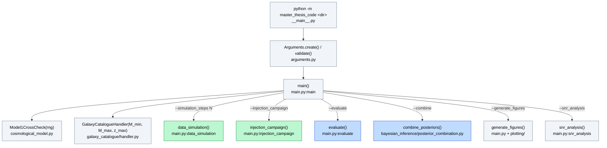
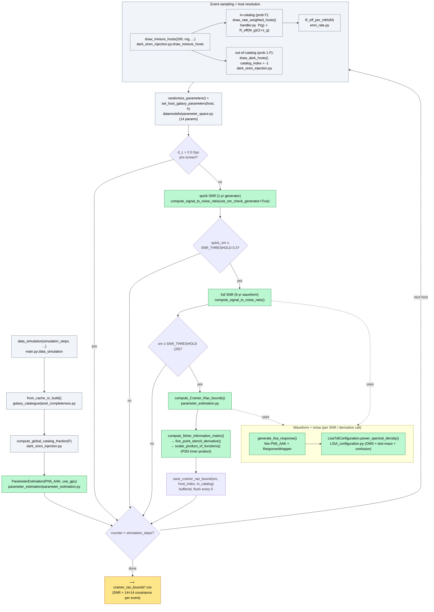
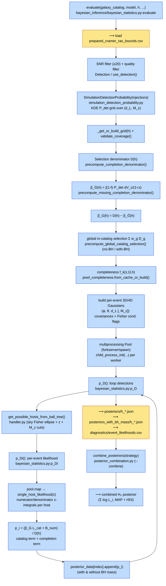
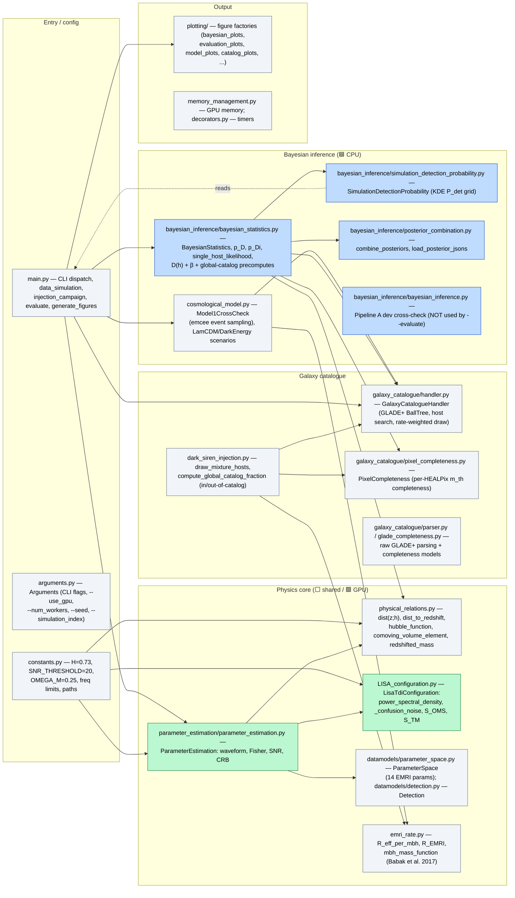

# Pipeline Flowchart — LISA EMRI Dark-Siren H₀ Inference

## Orientation

This codebase measures the Hubble constant H₀ from simulated LISA Extreme Mass-Ratio
Inspiral (EMRI) "dark siren" events. It is two independent pipelines joined by a CSV of
Cramér-Rao bounds (CRBs). **Pipeline 1** (GPU, on the cluster) samples EMRI events from a
cosmological rate model, resolves each to a GLADE+ host galaxy, builds a LISA waveform with
`few`, and computes the signal-to-noise ratio (SNR) and Fisher/Cramér-Rao parameter
covariance — writing one CSV row per detected event. **Pipeline 2** (CPU, multiprocessing)
reads those CRBs back, builds a per-event H₀ likelihood by marginalising over candidate host
galaxies with a galaxy-catalogue completeness correction (Gray et al. 2020) and a selection
denominator D(h), then combines the per-event posteriors into the final H₀ posterior. Both are
driven from a single CLI entry point, `master_thesis_code/main.py`, dispatched by the
`--simulation_steps`, `--injection_campaign`, `--evaluate`, and `--combine` flags parsed in
`arguments.py`.

### Legend

| Symbol | Meaning |
|--------|---------|
| 🟩 GPU / CUDA | Runs on the GPU partition (CuPy + `fastemriwaveforms-cuda12x`); guarded `cupy` fallback to NumPy on CPU |
| 🟦 CPU / MP | CPU only; uses a `multiprocessing` pool (forkserver/spawn) |
| ⬜ shared | Pure-Python/NumPy helper used by both pipelines |
| `file.py:symbol` | Owning source file and the function/class/method |
| ⟶ CSV / JSON | Data artefact written to / read from disk (the hand-off between pipelines) |

---

## Entry Point (shared)



`Model1CrossCheck` and `GalaxyCatalogueHandler` are constructed once and shared by whichever
pipeline the flags select. The simulation loop (Pipeline 1) and the injection campaign are
separate GPU run-modes; `--evaluate` is Pipeline 2.

---

## Pipeline 1 — EMRI Simulation (🟩 GPU / CUDA)

Produces the per-event Cramér-Rao bounds CSV. Driven by `main.py:data_simulation()`, looping
until `simulation_steps` events pass the SNR threshold.



**Notes**
- The event population is drawn by `Model1CrossCheck` (emcee MCMC over `(log₁₀M, z)` with
  `emri_distribution = dN_dz_of_mass(M, z) · R_emri(M)`; `cosmological_model.py`). In
  `data_simulation` the hosts are drawn directly from the catalogue via
  `draw_mixture_hosts` (in-catalogue rate-weighted + dark fraction); the emcee sampler is
  the population engine used by the `injection_campaign` run-mode.
- GPU is threaded explicitly via `use_gpu` into `ParameterEstimation`; the `_get_xp` /
  `_get_fft` helpers resolve CuPy vs NumPy once. `MemoryManagement` frees GPU blocks between
  steps. The 5-point stencil (`five_point_stencil_derivative`, default since Phase 10) is the
  O(ε⁴) Fisher-derivative method (Vallisneri 2008).

### Injection-campaign run-mode (🟩 GPU, SNR-only)

`main.py:injection_campaign()` reuses `Model1CrossCheck.sample_emri_events()` (emcee) and
`ParameterEstimation.compute_signal_to_noise_ratio()` but **skips the Fisher matrix**, storing
SNR for *all* sampled events (detected and sub-threshold) to `injections/injection_*.csv`.
That pool is the empirical input to the detection-probability estimator P_det in Pipeline 2.

---

## Pipeline 2 — Bayesian H₀ Inference (🟦 CPU / multiprocessing)

Driven by `main.py:evaluate()` → `BayesianStatistics.evaluate()`
(`bayesian_inference/bayesian_statistics.py`). Reads CRBs, builds per-event H₀ likelihoods,
writes per-event posterior JSONs.



**Notes**
- `evaluate()` is called once per candidate `h_value`; the grid of H₀ values is built by
  running `--evaluate --h_value …` repeatedly (one JSON per h) and combining at the end.
- D(h) and the β / global-catalogue selection tables are **event-independent**, computed once
  per h before the worker pool spawns. The per-event work (host search + `single_host_likelihood`
  z-integrals) is what the pool parallelises.
- The per-event likelihood is the Gray et al. (2020) catalogue-mixture form: an in-catalogue
  term `L_cat` (sum over candidate hosts, rate-weighted, completeness-scaled by `f`) plus a
  completion/out-of-catalogue numerator `B_num` (weighted by `1−f`), all normalised by the
  selection denominator `D(h)`. Two variants are produced throughout: **without** and **with**
  the redshifted BH mass `M_z` as an extra discriminating dimension.

---

## Module Map — who owns what



### Ownership table

| File | Owns | Pipeline |
|------|------|----------|
| `main.py` | CLI dispatch + both pipeline drivers (`data_simulation`, `injection_campaign`, `evaluate`, `generate_figures`) | both |
| `arguments.py` | `Arguments` CLI parsing (`--use_gpu`, `--num_workers`, `--seed`, `--simulation_index`, `--evaluate`, `--combine`) | both |
| `constants.py` | Physical/cosmological constants & config (`H=0.73`, `SNR_THRESHOLD=20`, `OMEGA_M=0.25`, frequency limits) | both |
| `cosmological_model.py` | `Model1CrossCheck` (emcee EMRI event sampler), `LamCDMScenario`, `DarkEnergyScenario` | 1 (sampling) |
| `emri_rate.py` | Per-MBH EMRI rate `R_eff_per_mbh`, volumetric `R_EMRI`, mass function | 1 + 2 (host weights) |
| `galaxy_catalogue/handler.py` | `GalaxyCatalogueHandler` — GLADE+ load, equatorial→ecliptic rotation, BallTree host search, rate-weighted host draw | 1 + 2 |
| `galaxy_catalogue/pixel_completeness.py` | `PixelCompleteness` — per-HEALPix-pixel magnitude-threshold completeness `f_k`, `f_bar` | 1 + 2 |
| `dark_siren_injection.py` | `draw_mixture_hosts`, `compute_global_catalog_fraction` — in-catalog vs dark host split | 1 |
| `datamodels/parameter_space.py` | `ParameterSpace` — the 14 EMRI parameters, randomisation, host→param mapping | 1 |
| `datamodels/detection.py` | `Detection` — one CRB row wrapped with sky-covariance accessors | 2 |
| `parameter_estimation/parameter_estimation.py` | `ParameterEstimation` — `few` waveform, Fisher matrix (5-pt stencil), `scalar_product_of_functions`, SNR, CRB, CSV write | 1 (GPU) |
| `LISA_configuration.py` | `LisaTdiConfiguration` — TDI PSD (`power_spectral_density`, OMS/test-mass/confusion noise) | 1 (GPU) |
| `physical_relations.py` | `dist(z;h)`, `dist_to_redshift`, `hubble_function`, `comoving_volume_element`, `redshifted_mass` | both |
| `bayesian_inference/bayesian_statistics.py` | `BayesianStatistics` (Pipeline B / production): `p_D`, `p_Di`, `single_host_likelihood`, D(h) + β + global-catalog precomputes | 2 (CPU) |
| `bayesian_inference/simulation_detection_probability.py` | `SimulationDetectionProbability` — KDE-based P_det grid + `RegularGridInterpolator` look-ups | 2 |
| `bayesian_inference/posterior_combination.py` | `combine_posteriors`, `load_posterior_jsons` — combine per-event JSONs into the H₀ posterior | 2 |
| `bayesian_inference/bayesian_inference.py` | Pipeline A dev cross-check (`BayesianInference`); **not** used by `--evaluate` | dev only |
| `memory_management.py` / `decorators.py` | GPU memory pool management; timing decorators | 1 |
| `plotting/` | All figures: factory functions (`data → (fig, ax)`) in topic modules; `_style.py` sets Agg + thesis mplstyle | output |

> Note: `CLAUDE.md` refers to a `bayesian_inference/detection_probability.py`; the live
> detection-probability class is `SimulationDetectionProbability` in
> `bayesian_inference/simulation_detection_probability.py`.

---

## The hand-off in one line

```
Pipeline 1 (GPU): events → hosts → waveform → Fisher → ⟶ cramer_rao_bounds*.csv
                                                          │
Pipeline 2 (CPU):  ⟶ read CSV → P_det + D(h) + per-host likelihood → ⟶ posteriors/*.json → combine → H₀
```
