Results Gallery
===============

Publication figures from the production dark-siren H\ :sub:`0` campaign
``run_20260620_seed500_phase50`` — a single homogeneous catalogue of **1385**
simulated EMRI detections evaluated on an **83-point** super-dense H\ :sub:`0`
grid (injected truth ``h = 0.73``).

Combined-posterior MAP estimates:

* **Without** M\ :sub:`z` (1D): ``h = 0.737`` (+1.0 %)
* **With** M\ :sub:`z` (2D): ``h = 0.732`` (+0.3 %)

All figures are produced by the package itself via
``python -m master_thesis_code <simulations_dir> --generate_figures <simulations_dir>``
(the PDFs shipped on the cluster are converted to PNG for web display).

H\ :sub:`0` inference
---------------------

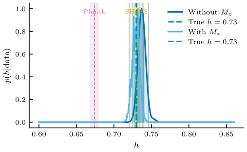

   **fig01 — Combined H₀ posterior.** Catalogue-combined posterior on H₀ for both
   mass conventions, with the injected truth marked.

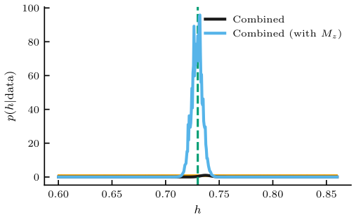

   **fig02 — Per-event posteriors.** Individual single-event H₀ likelihoods with
   the combined posterior overlaid.

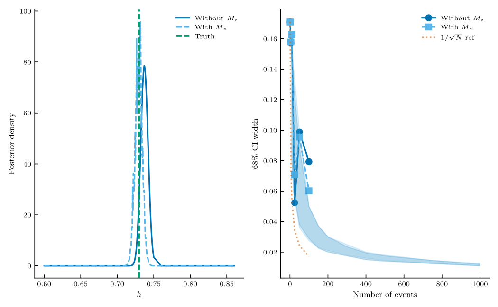

   **fig08 — H₀ convergence.** MAP H₀ and its credible interval as a function of
   the number of stacked detections.

Detection catalogue
-------------------

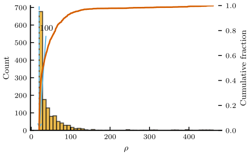

   **fig03 — SNR distribution.** Distribution of signal-to-noise ratios across the
   detected catalogue.

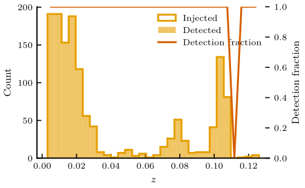

   **fig04 — Detection yield.** Detected EMRIs as a function of source parameters.

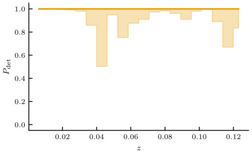

   **fig09 — Detection efficiency.** The selection function / detection efficiency
   used in the completeness correction.

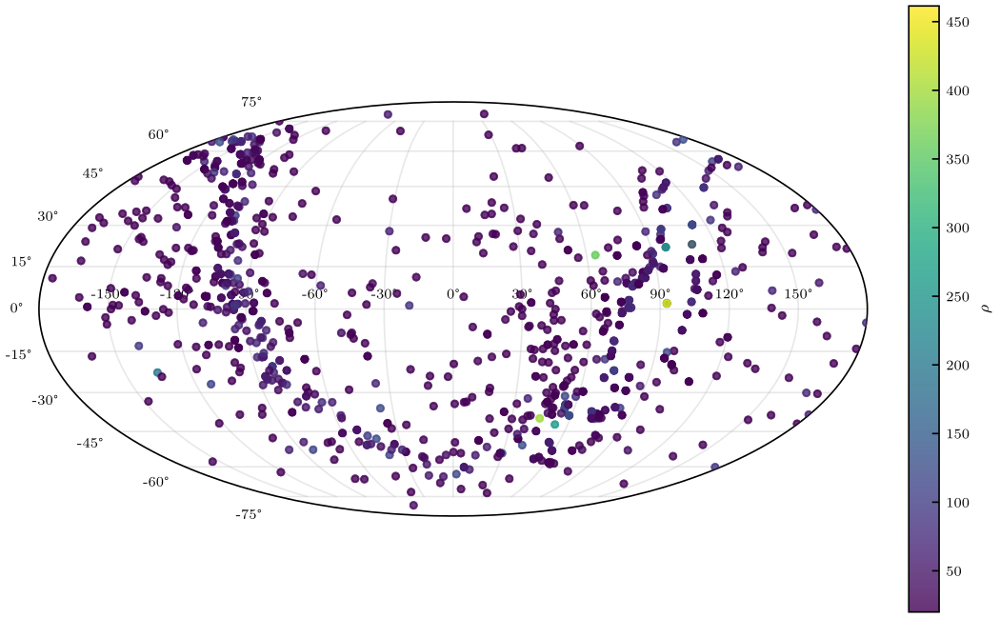

   **fig05 — Sky localization.** Sky-localization areas for the detected events.

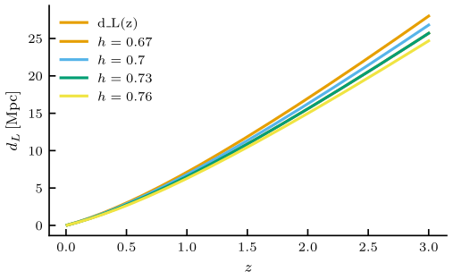

   **fig11 — Distance–redshift.** Luminosity distance versus redshift for the
   catalogue under the fiducial cosmology.

Parameter estimation
--------------------

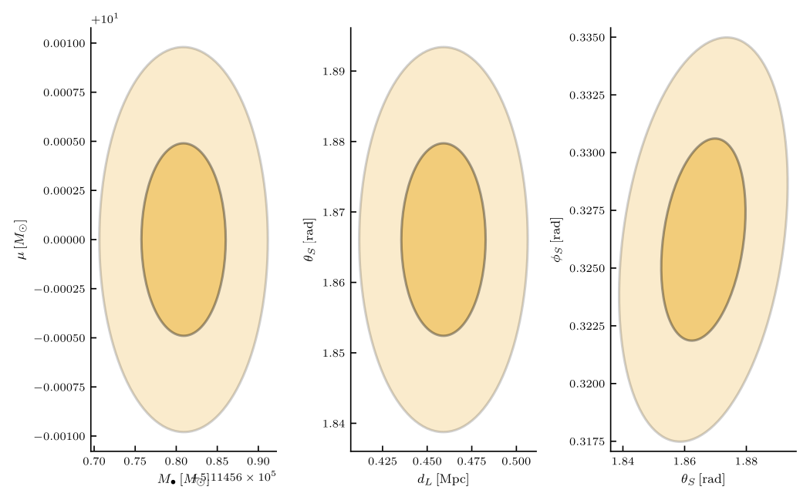

   **fig06 — Fisher ellipses.** Fisher-matrix uncertainty ellipses for
   representative events.

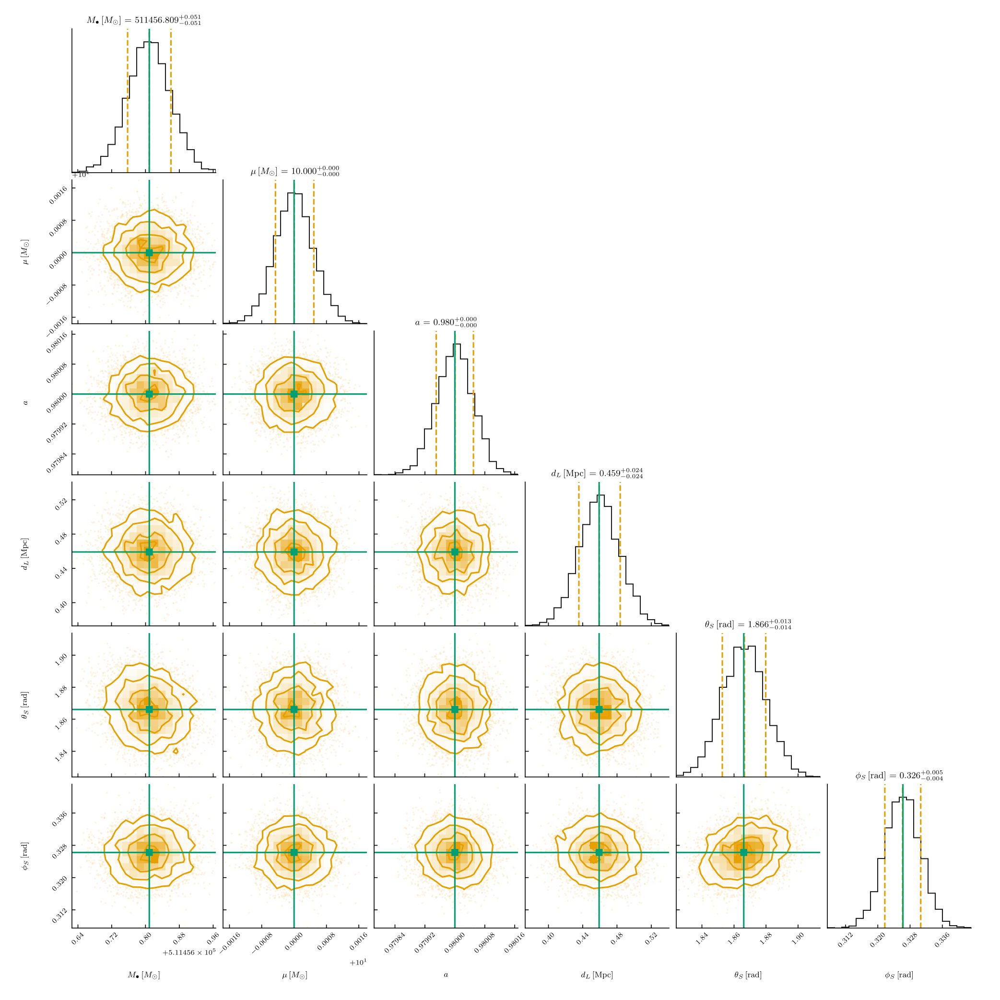

   **fig07 — Corner plot.** Parameter covariances for a representative event.

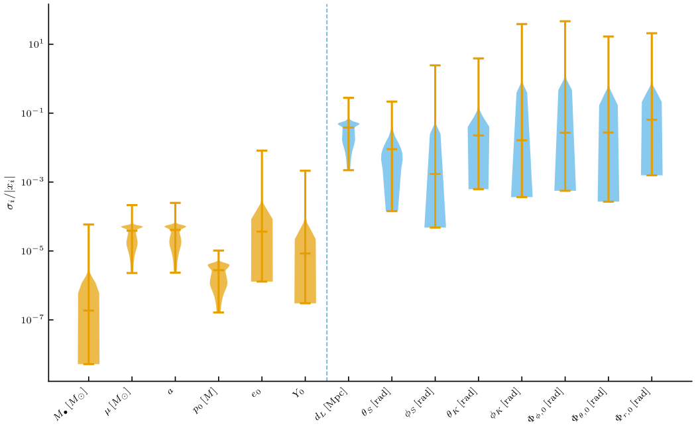

   **fig12 — Uncertainty violins.** Distributions of per-parameter Cramér–Rao
   uncertainties across the catalogue.

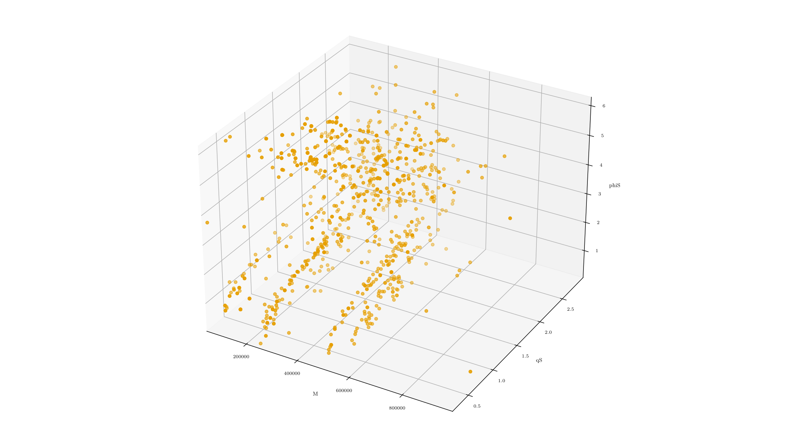

   **fig14 — CRB coverage.** Cramér–Rao bound coverage across the detected events.

Instrument & signals
-------------------

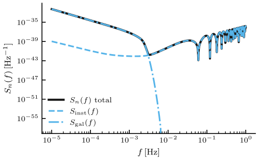

   **fig10 — LISA PSD.** The LISA noise power spectral density / sensitivity curve
   used in the analysis.

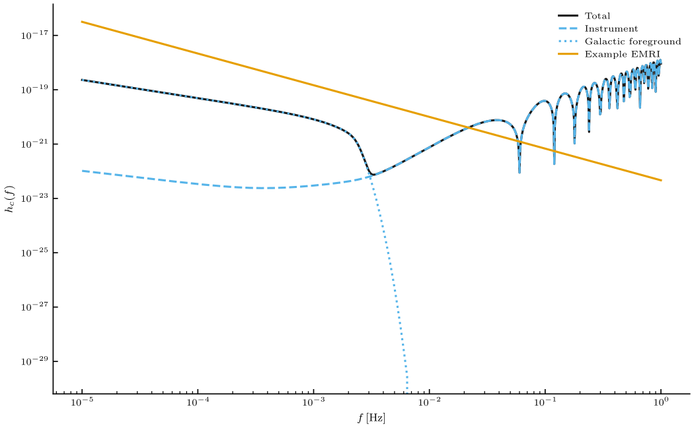

   **fig13 — Characteristic strain.** Characteristic strain of representative
   signals against the LISA sensitivity.

Campaign summary
---------------

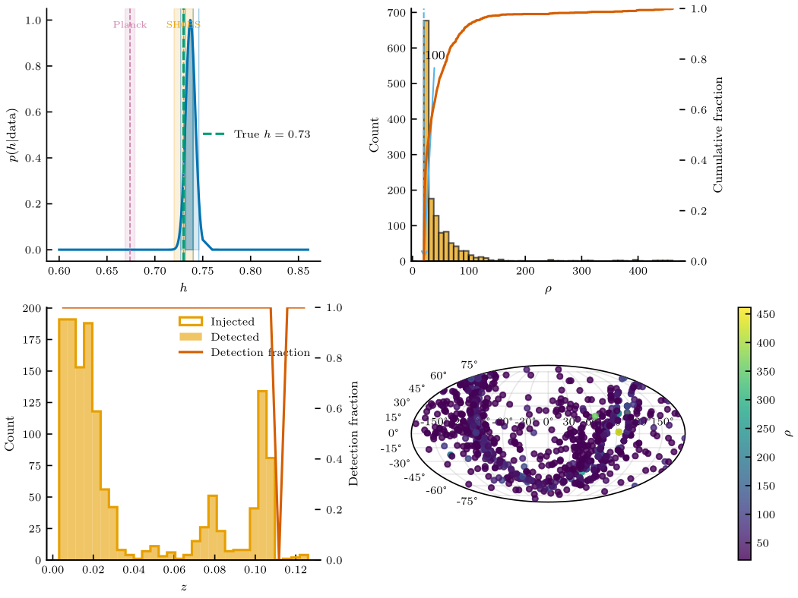

   **fig15 — Campaign dashboard.** One-page summary dashboard of the full
   production campaign.
