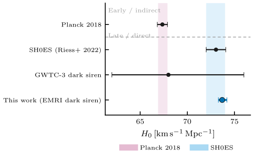

Results Gallery
===============

Publication figures from the production dark-siren H\ :sub:`0` campaign
``run_20260620_seed500_phase50`` — a single homogeneous catalogue of **1385**
simulated EMRI detections evaluated on an **83-point** super-dense H\ :sub:`0`
grid (injected truth ``h = 0.73``). All figures use the *Observatory + Atlas*
design system (method→colour grammar, Planck/SH0ES reference bands, flat-prior
overlay, nested HDI, Crameri scientific colormaps).

Combined-posterior MAP estimates:

* **Without** M\ :sub:`z` (1D): ``h = 0.737`` (+1.0 %)
* **With** M\ :sub:`z` (2D): ``h = 0.732`` (+0.3 %)

All figures are produced by the package itself via
``python -m master_thesis_code <simulations_dir> --generate_figures <simulations_dir>``
(the cluster PDFs are converted to PNG for web display).

H\ :sub:`0` inference
----------------------------------------

.. figure:: figures/fig01_h0_posterior_combined.png
   :width: 90%
   :alt: Combined H0 posterior

   **fig01 — Combined H₀ posterior.** Catalogue-combined posterior for both mass
   conventions as one blue separated by linestyle (solid Without M\ :sub:`z`,
   dashed With M\ :sub:`z`), with nested 50/68/95 % HDI shading, the flat H₀
   prior, Planck (pink) and SH0ES (cyan) bands, a km/s/Mpc top axis, and the MAP
   in the title.

.. figure:: figures/fig02_event_posteriors.png
   :width: 90%
   :alt: Per-event posteriors

   **fig02 — Per-event posteriors.** Peak-normalised single-event H₀ likelihoods
   coloured by SNR (batlow), with the catalogue-combined posterior as the black
   headline curve.

.. figure:: figures/fig08_h0_convergence.png
   :width: 90%
   :alt: H0 convergence

   **fig08 — H₀ convergence.** 68 % credible-interval width as a function of the
   number of stacked detections, with the 1/√N guide and Planck/SH0ES
   target-width reference bands; mass conventions by linestyle.

   **fig15 — H₀ in context.** This work against Planck 2018, SH0ES (Riess+ 2022),
   and GWTC-3 dark sirens, sharing the same Planck-pink and SH0ES-cyan bands as
   fig01.

Detection catalogue & cosmology
----------------------------------------

.. figure:: figures/fig03_snr_distribution.png
   :width: 90%
   :alt: SNR distribution

   **fig03 — SNR distribution.** Signal-to-noise distribution of the detected
   catalogue (grey histogram) with the cumulative fraction and the detection
   threshold rule.

.. figure:: figures/fig04_detection_yield.png
   :width: 90%
   :alt: Detection yield

   **fig04 — Detection yield.** Injected vs. detected redshift distribution from the
   injection campaign (504k injected; SNR ≥ 20 detected) with the per-bin detection
   fraction.

.. figure:: figures/fig09_detection_efficiency.png
   :width: 90%
   :alt: Detection efficiency

   **fig09 — Detection efficiency.** Empirical detection probability vs. redshift
   from the injection pool with a smooth selection-function fit.

.. figure:: figures/fig05_sky_localization.png
   :width: 90%
   :alt: Sky localization

   **fig05 — Sky localization.** Mollweide distribution of the detected events
   coloured by SNR (batlow).

.. figure:: figures/fig11_distance_redshift.png
   :width: 90%
   :alt: Distance-redshift relation

   **fig11 — Distance–redshift.** Luminosity distance d\ :sub:`L`\ (z) [Gpc] for a
   family of H₀ values, direct-labelled at the curve endpoints.

Parameter estimation
----------------------------------------

.. figure:: figures/fig06_fisher_ellipses.png
   :width: 90%
   :alt: Fisher ellipses

   **fig06 — Fisher ellipses.** 1σ/2σ Fisher-matrix uncertainty ellipses for a
   representative event, with the truth crosshair.

.. figure:: figures/fig07_corner_plot.png
   :width: 90%
   :alt: Corner plot

   **fig07 — Corner plot.** Analytic Fisher parameter covariances (no KDE
   smoothing) at 1σ and 2σ.

.. figure:: figures/fig12_uncertainty_violins.png
   :width: 90%
   :alt: Uncertainty violins

   **fig12 — Uncertainty violins.** Per-parameter fractional Cramér–Rao
   uncertainties, split into intrinsic and extrinsic groups.

.. figure:: figures/fig14_crb_coverage.png
   :width: 90%
   :alt: CRB coverage

   **fig14 — CRB coverage.** 2D pairwise hexbin density of the detected events
   across the key parameter pairs (batlow).

Instrument & signals
----------------------------------------

.. figure:: figures/fig10_lisa_psd.png
   :width: 90%
   :alt: LISA PSD

   **fig10 — LISA PSD.** A-channel noise PSD decomposed into instrument and
   galactic-confusion contributions (distinguished by linestyle).

.. figure:: figures/fig13_characteristic_strain.png
   :width: 90%
   :alt: Characteristic strain

   **fig13 — Characteristic strain.** Characteristic strain with a representative
   EMRI inspiral track against the LISA sensitivity.
