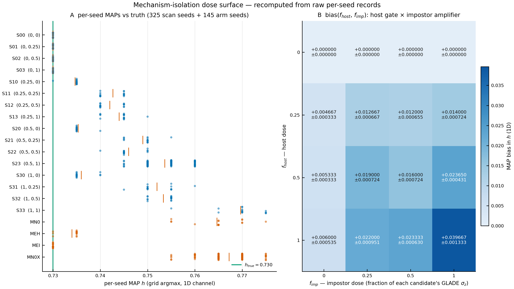

# CAMPAIGN READOUT REPORT — mechanism isolation, thread 17

## 1. Masthead

*Term-isolation study on the ball dark-siren estimator · thread 17 (`/physics-change` intake,
opened on ledger row #99) · 4 arms + 16 scan cells + 1 golden re-execution · 470 seeds ·
2 pre-registrations + 1 amendment · 2026-08-13 → 2026-08-14.*

> ## The question this campaign asked
>
> **Which term of the estimator produces the +1 × σ_z displacement of H₀?**
>
> A reader can answer that yes-or-no: **no.** A term was not identified. What was identified is an
> *input condition* (host redshift exactness) and a *shape* (gate × amplifier).

> ### VERDICT STRIP
>
> - **Parent tree (`PREREGISTRATION_MECHANISM_ISOLATION.md` §4): branch 2 — SINGLE-OWNER fires**, on
>   a count of exactly one TERM-OWNS arm (MEI, both channels). **Its meaning clause — *"that term is
>   the identified mechanism"* — has no referent: MEI ablates no estimator term.**
> - **Scan tree (`PREREGISTRATION_2D_DOSE_SCAN.md` §7): branch 2 — INTERACTION-BILINEAR fired**
>   (ratified, ledger row #101) **with its meaning clause barred from being quoted**, because the
>   scan's own statistics refute the bilinear form at +10.33σ.
> - **Validity: nothing failed.** V-M1 settled on data at N = 100 (A1-PASS, |Δ| = 0.000013);
>   V-M5 re-executed as the registered values golden (max rel dev 1.6135e-14 vs rtol 1e-12);
>   0 of 4 SCAN-CONFOUNDED members; 0 of the parent's branch-1 legs.
> - **Presented, not adjudicated.** This report rules on nothing, recommends nothing by implication,
>   and proposes no repair. The parent's branch call is still the author's to make.

---

## 2. The goal — what was actually being asked

### The prior finding (what was already believed, and how strongly)

The venue-transfer campaign (prereg `e77eecad`, instrument `2ece8801`, readout `d45fbf15`, ledger
row #99, **author-ratified 2026-08-13**) established, over 49 chunks and 1,400 seeds, that the
σ_z-dosed coverage collapse **survives production realism**. At the decision cell T-c(0.730),
N = 400, 1D channel:

| statistic | value | registered band |
|---|---|---|
| MAP bias | **+0.037237 ± 0.000230** | DEFECT edge 0.030 |
| HPD 50/68/90 coverage | **0.000 / 0.000 / 0.000** (0 of 400 seeds contained) | 0.870–0.930 at 90 % |
| PIT–KS D | **1.000**, saturated | PASS ≤ 0.0679 |
| `post_sd` median | 0.004376 ⇒ displaced by **8.5×** its own claimed width | — |
| R_dose = bias/σ̄_z | **0.891** | [0.75, 1.25] |
| rails | 0.000 / 0.000 | ≤ 0.02 |
| 2D alongside | +0.039713 ± 0.000246, R_dose 0.951 | — |
| σ_z = 0 anchor (T-0) | **all 200 seeds argmax exactly on truth** | — |

The ladder found **no killing axis**: v2 +0.0353 → T-a +0.0349 → T-b +0.0359 → T-c +0.0372. Real
events, real multiplicity and real heterogeneous GLADE σ_z each left the collapse intact. Adversarial
adjudication of that campaign: **CONFIRMED**, every scored statistic reproduced from raw `ln_post`
vectors to ≤ 5.33e-15.

### The objection this campaign answers

The campaign established **that** the estimator is displaced and **how it scales**. It did not
establish **which term** does it. The `/physics-change` gate — the repository's hard gate on any
formula change — requires five items before code is written, and item 2 is *the new formula*. On
2026-08-13 the author opened that intake (*"I want to open the physics change"*), and the honest
state of the package was: **the old formula could be written exactly; the new one could not be
written at all.** This study exists to fill exactly that slot, and its pre-registration says so in
its own words: *"it proposes no repair and adopts no candidate."*

**The design, in one line.** Vary one thing at a time — first analytically (L0 toys), then on the
instrument with **exactly one estimator term altered per arm** — while holding the campaign's
decision cell fixed (982 pinned events, real K_i, GLADE-empirical σ_z, h_true = 0.730, canonical
41-point grid, four pinned md5/census inputs), with every band, edge, seed block and branch fixed at
registration and never adjusted afterwards.

---

## 3. The design — the arms, the control, and what would have broken the effect

### The layered ladder and the cost argument that made it affordable

The per-seed bias is +0.037 against a per-seed MAP spread of ~0.005 — **≈7σ in a single seed**.
Discriminating "term removed" from "term intact" therefore does **not** need the campaign's N = 400.
The registered ladder (parent §1):

| layer | what it is | registered cost / ceiling |
|---|---|---|
| **L0** | analytic + A/B toy differing only in the term under test; a candidate whose implied MAP displacement is **< 1e-3 in h** is CLOSED with no instrument run | CPU-minutes, unlimited |
| **L1** | instrument confirmation, N = 25, one arm per surviving candidate | ≈95 CPU-h/arm at the campaign's 3.79 CPU-h/seed anchor; **≤ 5 arms** |
| **L2** | one confirmation arm at N = 200, only for a TERM-OWNS candidate and only on author order | **≤ 1 arm**; none was run or requested |

Realized cost, in the event, was far below that: the instrument came in at **0.969 CPU-h/seed**
(≈3.9× faster than the stale 3.79 anchor, plausibly the ratified Route 1 adaptive Gauss–Hermite
contraction reaching the validation stack). The three split-dose arms cost **29.2 core-h** (array
6303086, all three tasks COMPLETED inside one hour); the N = 100 null cost **≈51 CPU-h**; the 16-cell
scan cost **177.8 CPU-h** against ≈259 budgeted. **The scan — the largest single block, and the
document the "≈178 CPU-h in an evening" figure refers to — ran overnight; the whole programme is
≈258 CPU-h.**

### The arms, in registered ladder order

| rung | arm / cell | what varies | estimator changed? | headline (1D) |
|---|---|---|---|---|
| **control** | **MN0 (N-0)** | nothing — the campaign path | no | **+0.034667 ± 0.001579** (N = 15) |
| **control, re-bought** | **MN0X** (Amendment A1) | nothing; N = 15 → **N = 100** | no | **+0.037250 ± 0.000494** |
| L1 | **MEH (E1-host)** | σ_z applied to the **host only**; impostors exact | **no — generator-side dose** | **+0.004000 ± 0.000535** |
| L1 | **MEI (E1-imp)** | σ_z applied to the **impostors only**; host exact | **no — generator-side dose** | **+0.000000 ± 0.000000** |
| stage 2 | **S00…S33** (16 cells) | the two doses swept over f ∈ {0, 0.25, 0.5, 1.0} of each candidate's own GLADE σ_z | **no — generator-side dose** | surface in §4 |
| — | A-M2′, E3, A-M5b | registered but **never run** | — | no data |

**What would have counted as an arm breaking the effect** (the killing-axis rule, stated so the
reader can see the test could have failed): DS-M1 classified an arm **TERM-OWNS** iff |b| ≤ 0.010
**and** HPD90 ≥ 0.60. The registered decisive read, DS-M5, demanded **both** E1-imp ≥ 0.030 **and**
E1-host ≤ 0.012; a split in the opposite direction was pre-registered as *refuting* M5′ and
returning the study to the M2′ arm. On the scan side, `b(S00) ≠ 0.000000` was a hard confound
trigger, and A1-FAIL would have voided every measurement in the thread.

### The control, called out separately

**MN0 / MN0X is the licence to believe everything else on this page.** MN0X reproduces the campaign
decision cell not merely on the mean but on its **entire signature**: bias +0.037250 vs +0.037237
(|Δ| = 0.000013), 2D +0.039750 vs +0.039713 (|Δ| = 0.000037), coverage 0.000/0.000/0.000, PIT–KS
1.000, bias/post_sd 8.49 vs the campaign's 8.51, rails 0.000. The σ = 0 apparatus anchors are exact:
T-0 put 200/200 seeds on truth in the campaign, and S00 returns bias exactly +0.000000 with exactly
zero spread on 15/15 fresh seeds here.

---

## 4. The result — the money chart



*Figure — `fig_dose_surface_20260814.png/.pdf`, produced by `plot_dose_surface.py` from the raw
`per_seed` records of all 20 cells/arms (no `aggregate` block read). **Panel A**: every one of the
470 per-seed MAPs, one row per cell, sharing one axis, with the truth marker h_true = 0.730 in green
and each cell's mean as a vermillion tick. **Panel B**: the 16-cell surface bias(f_host, f_imp),
annotated with each cell's bias ± SE. Project palette (`plotting/_colors.py`, Okabe-Ito) and style
sheet (`emri_thesis.mplstyle`) via `apply_style()` / `get_figure()` / `save_figure()`.*

The figure's 20 recomputed means reproduce the committed readouts **to the printed digit in every
cell and every arm** (`fig_dose_surface_20260814.json`).

### The three headline numbers

| card | expected | observed |
|---|---|---|
| **Direct decision statistic** — DS-M5, the registered split-dose conjunction | E1-imp ≥ 0.030 **and** E1-host ≤ 0.012 | **E1-imp +0.000000** (shortfall = the entire 0.030) · E1-host +0.004000 ✓ → **M5′ NOT CONFIRMED, refuted as stated** |
| **Effect size in the reader's units** — the null arm's H₀ bias | campaign +0.037237 ± 0.000230 | **MN0X +0.037250 ± 0.000494** (N = 100), i.e. H₀ recovered ≈ 5 % high |
| **Effect relative to the estimator's own claimed uncertainty** | — | **bias / post_sd = 8.49** (1D) and **9.02** (2D); coverage 0/100 at every level; PIT–KS 1.000 |

### The four L0 closures — four candidates retired before any instrument run

| candidate | the claim | how it died | strength |
|---|---|---|---|
| **M3** — h-dependent truncation of an unrenormalised kernel | the window clips kernel mass differently at each h | mechanism is **real** but the edge is pinned at ±4σ in the *GW* variable, so everything discarded lives under e⁻⁸ of the peak; A/B toy (12σ_d vs 4σ_d) gives implied MAP shift **+6.0e-7** against +0.0372 — **short by a factor 6.2e4** — and its implied shifts *decrease* with dose (2.3e-6 / 8.1e-7 / 6.5e-7 at σ_z = 0.011 / 0.035 / 0.042), the **wrong trend** | analytic ceiling, measured tight |
| **M4** — α(h) is σ_z-blind | the selection normalisation ignores σ_z | the "missing" term is **identically 1** (the kernel is a normalised density in its own datum; ball membership is decided on *true* z). Direct test on 2,400 stored posteriors: **deleting α outright** leaves +0.0353 → **+0.0165** at σ_z = 0.035 and +0.0107 → +0.0056 at 0.010, still ≈ linear — **the σ_z keying survives total deletion of α** | exact + direct |
| **M1** — bare kernel, missing w_pop volume prior | the numerator omits the population measure | Bayes-correct E[z_true\|z_obs] = z_obs + σ_z²λ with λ ≈ 2.3–2.9 **positive** on the venue's 982-event population ⇒ M1 biases H₀ **LOW** by 0.02–0.04: same order, **WRONG SIGN**. Retained only as a compounding negative quadratic (fit a ≈ +1.15, b ≈ −5.29) | sign is categorical |
| **M5 as stated** — flat 1/K prior over a smeared population | the candidate prior is applied at scattered positions | **attribution fails**: with the population **not scattered at all**, **76 % of the bias survives**; deleting the window truncation moves it by −1 %; no prior or weight repair attenuates (rate weights +2 %, oracle weights +1 %, w_pop inside the integral +28 %, window renormalisation +22 %) | toy, validated against T-0 |
| **M2** — missing Jacobian in the point distance term | — | would bias T-0, which is **clean** (200/200 seeds exactly on truth) | anchor |

**THE PARITY ARGUMENT — the constraint that outlives all of them.** Gaussian convolution is
exp(σ²∂²/2), an expansion in **even powers of σ only**. Every "we convolved wrong" story is therefore
O(σ_z²) at leading order and predicts R_dose ∝ σ_z — a **3.5×** change across the B1→B2 dose lever.
**Measured: 0.92** (R_dose 1.103 → 1.012; fitted exponent bias ∝ σ_z^0.93). **A surviving mechanism
cannot be a symmetric smoothing of any kind.** It needs genuine first-order structure at scale σ_z —
a support edge, the argmax operation itself, or a host/impostor asymmetry inside the ball window.

### The split-dose inversion, and its non-additivity

```
registered DS-M5 prediction (parent §2):   E1-imp >= 0.030   E1-host <= 0.012
measured on the instrument:                E1-imp  = 0.000000  E1-host = +0.004000

toy ratio at K = 50   imp/host = 0.0247 / 0.0062 = 3.98
instrument ratio                 = 0.000000 / 0.004000 = 0.00

MEH + MEI = +0.004000   vs   MN0 = +0.034667   ->  residual +0.030667 / 0.00166667 = +18.40 sigma
                             vs  MN0X = +0.037250  ->  residual +0.033250 / 0.000728 = +45.67 sigma
```

The two doses together produce **8.7× what they produce apart**; the split arms recover only 11.5 %
of the null (10.7 % against MN0X). The 2-D scan measured the same residual independently, on fresh
seeds in a different decade: **D(1,1) = +0.033667 at 23.4σ**. Additivity is dead three times over.

**MEI is not a small bias — it is a numerical delta at truth.** All 15 seeds land on the 0.730 grid
point, the posterior holds 1.000 of its mass there, and the true point beats its best competitor by a
**median 2,299 nats** (min 1,562). Reaching the registered 0.030 would require moving six grid steps
against e^−1562 at worst. Its SE of exactly 0.000000 is a genuine degeneracy, not an under-powered
measurement.

### The surface, and the shape it actually has

| f_h \ f_i | 0.0 | 0.25 | 0.5 | 1.0 |
|---|---|---|---|---|
| **0.0** | +0.000000 | +0.000000 | +0.000000 | +0.000000 |
| **0.25** | +0.004667 | +0.012667 | +0.012000 | +0.014000 |
| **0.5** | +0.005333 | +0.019000 | +0.016000 | **+0.023650** (N = 100) |
| **1.0** | +0.006000 | +0.022000 | +0.023333 | +0.039667 |

> ### READ THIS BEFORE ANYTHING ELSE — the shape of the failure
>
> **This is not a noisy-wide failure and it is not an edge-rail. It is confidently wrong**: the
> posterior is ~9 grid points across, holds no mass at truth (PIT ~1e-19, coverage 0/400 in the
> campaign and 0/100 in the null arm), sits **8.5× its own claimed width** away from the true value,
> and never rails. An estimator that is wide or railed announces its own failure; this one does not.
>
> **And the mechanism-side finding is an asymmetry, not a product.** The host dose is an **absolute
> gate**: at f_host = 0 the bias is **exactly** +0.000000 at *every* impostor dose including full
> dose — 60/60 seeds, per-seed sd exactly 0, every posterior on a single grid point. Not attenuated,
> annihilated. The impostor sea is a **graded amplifier**: removing it leaves +0.0047…+0.0060, about
> 15 % of the effect. **Gate × amplifier — which supports half of the scan branch's pre-stated
> consequence and refutes the other half.**
>
> ### AND THE THREE THINGS THAT MUST NOT BE READ PAST
>
> **(1) Both registered trees fired a branch whose MEANING CLAUSE has no referent — two
> independently drafted pre-registrations, the same pathology.** The scan's DS-D3 is a **one-sided
> threshold with no upper edge**, so it returns SHAPE-INTERACTION for any sufficiently large value —
> *including values that refute the hypothesis it names*: b(S23) = +0.023650 sits **+10.33σ above
> H-INT's own point prediction** (registered SE; +14.6σ realized). The parent's branch 2
> (SINGLE-OWNER) is satisfied by **MEI — an arm that ablates no estimator term at all**, since E1 is
> registered (parent §2, `ARMS.md`) as a **zero-estimator-change, generator-side** arm with
> `_channel_terms_at_h`, `log_channel_posteriors_ball_sigma_vector` and `_g_ball_capped`
> byte-identical across all three arms. This is a methodological finding in its own right and is
> carried as such into §10.
>
> **(2) The study's title question is NOT answered.** Both documents vary a **generator-side dose**.
> Not one of the 4 arms and not one of the 16 cells ablates an estimator formula. What is established
> is an **input condition** (host exactness) and a **shape** (gate × amplifier) — **not a term**.
> **M2′ (missing measure/Jacobian inside the z-integral, `venue_transfer.py:1138-1141`) remains the
> register's only unrun candidate, and the `/physics-change` package's new-formula slot is EMPTY.**
>
> **(3) Three pre-registration design faults are on the record — all recorded, none repaired.** The
> ±0.002 V-M1 window (asserted, never derived, ~21 % false-fail under an exact null); DS-D3's
> one-sided threshold; and now the branch-2 meaning-clause mismatch. **None was adjusted**, per the
> anti-tuning clauses — which is the correct behaviour and is also why three known-defective rules
> are still sitting in the registered documents.

---

## 5. The mechanism check — the dose response, against its registered bands

| registered statistic | rule as locked | measured | class |
|---|---|---|---|
| **DS-D2** additivity at S33 | NON-ADDITIVE iff \|D\| ≥ 3·SE_D on realized SEs | D(1,1) = **+0.033667**, SE_D 0.001436 | **NON-ADDITIVE, 23.44σ** (and ≥10σ at all nine interior cells) |
| **DS-D3** shape at S23 (N = 100) | SHAPE-INTERACTION iff b ≥ **0.01150132**; SHAPE-THRESHOLD iff b ≤ **0.00783208** | b = **+0.023650** | **SHAPE-INTERACTION**, +28.2 realized SE (+19.9 registered SE) above the boundary — **while sitting +10.33σ above H-INT's own prediction 0.017333** |
| **DS-D4** the pin test | PIN-BINARY iff all four f_h = 0 cells are exactly zero | +0.000000 ×4, sd 0.000000, one grid point, 60/60 seeds | **PIN-BINARY** |
| **DS-D5** linearity along f_host = 1 | departure from the line (0, 0.004000)–(1, 0.034667) ≥ 0.004737 | S31 **+0.010333 high (+10.9 SE)**; S32 +0.004000 (+6.4 SE, below the edge) | **SUPER-LINEAR at S31** (≥8σ under self-anchoring); LINEAR-CONSISTENT at S32 |
| **DS-D6** R_dose | band [0.75, 1.25] at **S33 only** | S33 **0.9487** (MN0's own anchor 0.8291, MN0X 0.8912) | **IN BAND**; all other cells reported unbanded as registered |
| **DS-M3** dose-scaling of the residual | flat doses 0.011 / 0.035, R_dose < 0.25 | **no flat-dose arm exists** (E3 never run) | **NOT EVALUABLE** |
| **DS-M4** the W1 weights question | WEIGHTS-MATTER iff \|b\| moves > 0.004 | arm A-M5b **withdrawn at registration**; L0 toy gives rate weights +0.00067, oracle +0.00033 | **NOT EVALUABLE on the instrument**; WEIGHTS-INERT on the toy, no branch weight |

**Both registered shapes are quantitatively wrong.** H-THRESH is refuted on its own terms at
**17.96σ** (S13) and **50.18σ** (S23) — row f_h = 0.25, less than half the registered threshold
f* = 0.5262, already carries +0.014000, so there is no step and no dead zone. H-INT's strictly
bilinear signature D = I·f_h·f_i has **positive residuals at all nine evaluable cells** and >3σ at
S22 (+3.76), S31 (+7.64) and S23 (+5.47, N = 100); S31 departs at ≥7σ under **both** anchorings. The
f_host = 1 row — the one row on which the two hypotheses are degenerate and **both demand a straight
line** — is non-linear at **−9.29σ** (slope drop) and **+5.03σ** (slope recovery).

**What the surface does NOT support, stated so it is not read in**: no plateau between f_i = 0.25 and
0.5 (1.17σ, UNRESOLVED); no dip at f_h = 0.5 (2.93σ, MARGINAL — see the convention-fragility
disclosure in §9); **no functional form of any kind** — the registered floor gives ≈5.175
distinguishable levels across the range and §6 item 8 of the scan prereg bars finer claims. The scan
readout records explicitly that fitting an S-curve was tempting and that it is barred.

---

## 6. The scorecard — every cell × channel against its locked band

Bands were fixed at pre-registration (parent §3, scan §4.7, amendment §8 anti-tuning clauses) and
**unchanged after readout**. Decision rows are bold.

### Parent arms — DS-M1 classification (edges: TERM-OWNS |b| ≤ 0.010 **and** HPD90 ≥ 0.60 · TERM-PARTIAL 0.010 < |b| < 0.030 · TERM-INNOCENT |b| ≥ 0.030 **and** |b − b_N0| ≤ 0.004 · OTHER = anything else)

| arm | ch | b | SE | \|b − b_N0\| | HPD 50/68/90 | post_sd med | class |
|---|---|---|---|---|---|---|---|
| MN0 | 1D | +0.034667 | 0.001579 | 0.000000 | 0.000/0.000/0.000 | 0.004265 | TERM-INNOCENT |
| MN0 | 2D | +0.037000 | 0.001604 | 0.000000 | 0.000/0.000/0.000 | 0.004315 | TERM-INNOCENT |
| MEH | 1D | +0.004000 | 0.000535 | 0.030667 | 0.200/0.200/0.333 | 0.000187 | OTHER |
| MEH | 2D | +0.004333 | 0.000454 | 0.032667 | 0.133/0.200/0.267 | 0.000262 | OTHER |
| **MEI** | **1D** | **+0.000000** | **0.000000** | **0.034667** | **1.000/1.000/1.000** | **0.000000** | **TERM-OWNS** |
| **MEI** | **2D** | **+0.000000** | **0.000000** | **0.037000** | **1.000/1.000/1.000** | **0.000000** | **TERM-OWNS** |
| MN0X | 1D | +0.037250 | 0.000494 | 0.002583 | 0.000/0.000/0.000 | 0.004386 | TERM-INNOCENT |
| MN0X | 2D | +0.039750 | 0.000519 | 0.002750 | 0.000/0.000/0.000 | 0.004407 | TERM-INNOCENT |

DS-M2's registered 2σ coverage bands (0.500 ± 0.200 / 0.680 ± 0.187 / 0.900 ± 0.120, the parent's
N = 25 rows) are **outside** in every arm: the nulls collapse to 0.000 at all three levels; MEH
*under*-covers; **MEI *over*-covers at 50 and 68 (1.000 against bands topping out at 0.700 and
0.867)** — the signature of a degenerate posterior, not a calibrated one. DS-M2 carries branch weight
only through the TERM-OWNS conjunction, which reads HPD90 alone.

### Scan cells — DS-D1 surface, both channels

| cell | f_h | f_i | N | 1D bias | SE | 2D bias | rails | non-finite |
|---|---|---|---|---|---|---|---|---|
| S00 | 0.0 | 0.0 | 15 | +0.000000 | 0.000000 | +0.000000 | 0.000 | 0 |
| S01 | 0.0 | 0.25 | 15 | +0.000000 | 0.000000 | +0.000000 | 0.000 | 0 |
| S02 | 0.0 | 0.5 | 15 | +0.000000 | 0.000000 | +0.000000 | 0.000 | 0 |
| S03 | 0.0 | 1.0 | 15 | +0.000000 | 0.000000 | +0.000000 | 0.000 | 0 |
| S10 | 0.25 | 0.0 | 15 | +0.004667 | 0.000333 | +0.005000 | 0.000 | 0 |
| S11 | 0.25 | 0.25 | 15 | +0.012667 | 0.000667 | +0.013000 | 0.000 | 0 |
| S12 | 0.25 | 0.5 | 15 | +0.012000 | 0.000655 | +0.013000 | 0.000 | 0 |
| S13 | 0.25 | 1.0 | 15 | +0.014000 | 0.000724 | +0.015333 | 0.000 | 0 |
| S20 | 0.5 | 0.0 | 15 | +0.005333 | 0.000333 | +0.005333 | 0.000 | 0 |
| S21 | 0.5 | 0.25 | 15 | +0.019000 | 0.000724 | +0.019333 | 0.000 | 0 |
| S22 | 0.5 | 0.5 | 15 | +0.016000 | 0.000724 | +0.017000 | 0.000 | 0 |
| **S23** | **0.5** | **1.0** | **100** | **+0.023650** | **0.000431** | **+0.024650** | 0.000 | 0 |
| S30 | 1.0 | 0.0 | 15 | +0.006000 | 0.000535 | +0.006000 | 0.000 | 0 |
| S31 | 1.0 | 0.25 | 15 | +0.022000 | 0.000951 | +0.023000 | 0.000 | 0 |
| S32 | 1.0 | 0.5 | 15 | +0.023333 | 0.000630 | +0.025000 | 0.000 | 0 |
| S33 | 1.0 | 1.0 | 15 | +0.039667 | 0.001333 | +0.042000 | 0.000 | 0 |

**No 1D/2D split anywhere** — in any arm or any cell. 2D runs +0.000333 … +0.002333 above 1D (below
one core grid step of 0.005), with **identical classifications at every registered decision point**.
The parent §6 clause *"a 1D/2D split in any arm forces the MULTI-TERM branch"* has no subject.

**Band footnotes.** DS-M1's edges (0.010 / 0.030 / 0.004 / 0.60) and DS-M2's bands were registered on
the parent's **N = 25** rows while the arms ran at **N = 15** (disclosure D-M-1): the edges are
absolute numbers and were applied **unchanged**; only the SE commentary attached to them assumed
N = 25, and no classification changes under either N. DS-D3's boundaries were computed at S23's
N = 100 SE (0.00061154) at registration time, before any cell ran; the ±0.004737 single-cell
dead-band applies to every other cell.

---

## 7. The vocabulary — every symbol, glossed, with its decision-cell value

**h** — the dimensionless Hubble parameter, h = H₀/(100 km s⁻¹ Mpc⁻¹). It is the only inferred
quantity here, and it enters the estimator as a pure prefactor, d_L(z,h) = D(z)/h. Everything on this
page is a displacement in h. *Truth in every cell: **0.730**. Recovered by the null arm: **0.767250**
(grid MAP mean).*

**b (bias)** — mean over seeds of (per-seed grid-argmax MAP h) − 0.730. Because the MAP is an argmax
on a 41-point grid with 0.005 spacing in the core, a per-seed bias is an integer multiple of 0.005 and
an N-seed mean is a multiple of 0.005/N. *Decision cell: **+0.037237 ± 0.000230** (campaign, N = 400);
**+0.037250 ± 0.000494** (this study's null, N = 100).*

**σ_z** — a galaxy's photometric-redshift uncertainty, drawn z-decile-matched from the pruned GLADE
frame. It is the *dose*: the thing whose presence produces the displacement and whose absence removes
it. *Realized mean per candidate at full dose: **0.041813**; GLADE frame median 0.03934.*

**f_host, f_imp** — the two dose fractions of the scan, each multiplying **each candidate's own**
σ_z (not a flat dose). f = 1 is the production GLADE dose, f = 0 makes that candidate's redshift
exact and switches the estimator to its point-evaluation branch. *Grid: {0, 0.25, 0.5, 1.0}²;
decision cell S23 = (0.5, 1.0).*

**Host / impostor** — inside each event's candidate ball, the host is the one galaxy that actually
produced the GW event; the impostors are the other K_i − 1 catalogue galaxies that cannot be
distinguished from it. The whole finding is that these two are **not symmetric**. *982 hosts against
1,192,721 impostors — a host share of 8.2265e-4 of the candidate pool.*

**K_i, ΣK** — candidate multiplicity per event and its total, pinned to the real frozeng emit so that
every arm consumes the identical population. *ΣK = **1,193,703**, nonempty mean K̄ ≈ **1,216**, max
245,364, on every seed of every arm and cell.*

**post_sd** — the posterior's own standard deviation: the uncertainty the estimator *claims*.
Comparing it to b is what turns "biased" into "confidently wrong". *Median **0.004376** at the
decision cell ⇒ **bias/post_sd = 8.5**; MN0X 0.004386 ⇒ 8.49.*

**HPD 50/68/90 coverage** — the fraction of seeds whose highest-posterior-density interval at that
level contains the true h. A calibrated estimator returns ≈0.50/0.68/0.90. *Decision cell:
**0.000/0.000/0.000** — 0 of 400. MEI: 1.000/1.000/1.000 — over-coverage from a degenerate posterior,
which is information, not calibration.*

**PIT–KS D** — Kolmogorov–Smirnov distance of the probability-integral-transform values from
uniform; 0 is perfect, 1 is total. *Decision cell and both null arms: **1.000**, saturated (max PIT
1.9e-11).*

**rails** — the fraction of seeds whose MAP lands on the first or last grid point, i.e. the posterior
running off the edge. An **absent** failure mode is information: it means the displacement is a real
interior maximum and not a grid artefact. *R_low = R_high = **0.000** in every arm, every cell, both
channels — 470 seeds, zero rails, zero non-finite `ln_post`.*

**R_dose = b / σ̄_z** — the displacement measured in units of the dose. R_dose ≈ 1 is the "+1 × σ_z"
signature; the parity argument says a symmetric-smoothing mechanism would instead make R_dose grow
∝ σ_z. *Campaign 0.891; MN0 0.8291; MN0X 0.8912; S33 **0.9487** (band [0.75, 1.25], the only banded
cell). Measured drift across the B1→B2 lever: **0.92** against a predicted 3.5.*

**D(f_h, f_i) = b(f_h,f_i) − b(f_h,0) − b(0,f_i) + b(0,0)** — the interaction residual: identically
zero for any additive surface, exactly, with no approximation. *D(1,1) = **+0.033667**, SE_D
0.001436 ⇒ **23.44σ**; ≥10σ at all nine interior cells.*

**α(h)** — the selection normalisation, one scalar per h shared by all 982 events, subtracted as
−N ln α(h). It is a σ_z-**blind** amplifier: d ln α/d ln h = −1.0358 (power-law to 0.2 %). *Deleting
it entirely leaves **+0.0165** at σ_z = 0.035 — it roughly doubles the amplitude but does not key it.*

**τ = D/D′, ζ_k, s, f\*** — the marginalisation Jacobian; a candidate's observed (scattered)
redshift; the GW likelihood's width expressed in z (**s ≈ 0.022**); and the registered H-THRESH
switch-on fraction **f\* = s/σ̄_z = 0.5262**. *H-THRESH predicted no ramp below f\*; row f_h = 0.25
carries +0.014000 — refuted at 18σ.*

**I = 0.030667** — the registered bilinear interaction anchor, from the parent's corners. *H-INT
predicted b(S23) = 0.017333; measured +0.023650, i.e. **+10.33σ above its own prediction**.*

**TERM-OWNS / TERM-PARTIAL / TERM-INNOCENT / OTHER** — the four DS-M1 classes. TERM-OWNS is the one
that means "removing this makes the defect go away". *Count of TERM-OWNS arms: **exactly 1** (MEI) —
which is what fires branch 2, and which ablates no estimator term.*

---

## 8. Why the numbers stand

### Validity

| check | what it demands | result |
|---|---|---|
| **V-M1** null reproduction | MN0 within ±0.002 of +0.037237 | **N = 15: MISSED** (\|Δ\| = 0.002570, 1.63σ) — recorded as FAILED on the record. **N = 100 (Amendment A1): A1-PASS**, \|Δ\| = **0.000013**, 153.8× inside, 0.024σ of SE_diff; the fresh-85 seeds alone mean +0.037706, +3.57σ **above** the registered fail threshold |
| **V-M2 / AR-1..AR-3** generator invariance | pre-dose realisation bit-identical across arms; only the mask/fraction differs | **PASS on the evidence available**: 11/11 registered unit tests pass at HEAD; AR-1 confirmed empirically **cross-commit** at max rel dev **0.0** on 15 seeds × 44 fields. AR-3 not checkable in-data by design (disjoint seed blocks) — disclosed as D-M-6 |
| **V-M3** pin integrity | 4 pinned inputs re-verified before any arm | **PASS** in all 4 arms and all 16 cells: CRB CSV md5 `9a1f2a14…`, frozeng emit md5 `34c50e91…`, K census/ΣK 1,193,703, pruned σ_z stats n = 20,834,171 |
| **V-M4** clean rule | no uncommitted change inside the import path | **PASS**: `import_path_clean = true`, `allow_dirty = false`, dirt inventory empty everywhere (git dirt confined to `results/`) |
| **V-M5** no-drift values golden | every shared field within rtol ≤ 1e-12 **and** both channels' MAPs exactly equal | **PASS** — re-executed 2026-08-14 at HEAD `94c0480a`: max relative deviation **1.6135e-14** (`pit_2d`), two orders of magnitude inside; 1D channel bit-identical on all three registered v2 seeds; all four MAP fields exactly equal. Closes disclosure D-A1-2 |
| **abort (a)** non-finite ln_post > 1 % | — | **NO** — 0 of 470 seeds, both channels |
| **abort (b)** horizon drop > 5 % | — | **NO** — `n_horizon_dropped` max 0 everywhere |
| **abort (c)** any V-M failure | — | **NO** |
| **abort (d)** L0 toy and L1 instrument disagree in **sign** | — | **NO on the literal wording** — see the disclosure below; it is the closest call in the study |
| **dosing verification** | realized σ̄ within 2 % (f_i > 0) / 10 % (f_i = 0) of the registered prediction | **16/16 in tolerance**; arms: MN0 0.041813, MEI 0.041786, MEH 0.000035 = 0.041813 × 982/1,193,703 — exactly and only the hosts are dosed |
| **seed plan** | disjoint blocks, unit-tested before any run | **exact**: 325 scan seeds in +51000…+52514 with zero collisions across all 120 cell pairs; arms in +50000…+50999; MN0 ⊂ MN0X; MN0X terminates one seed below MEH's first |
| **budget** | L1 ≤ 5 arms, L2 ≤ 1 | **not exceeded** — 3 L1 arms; MN0X consumes no slot (A1 §4.5); no L2 arm run or requested. The scan's 16 cells and its new seed decade were **granted** by the author on 2026-08-13 |
| **provenance** | — | preregs `73141160`; instrument `e83ed0b9` (arms) / `3aedbe55` (MN0X + scan); data `5b0bd17a`; V-M5 run `94c0480a`; dossier `ee5815f9`; V-M5 artifact `38465df8` |

### Abort (d) — the closest call in the study, stated at full strength

```
arm  MEI (impostors only)     L0 toy (K = 50):  +0.0247
                              L1 instrument (K̄ ≈ 1,216):  +0.000000
```

That is a **100 % magnitude disagreement** — the entire predicted arm effect is absent. Criterion (d)
as registered fires on a disagreement **in sign**, and **zero has no sign**, so on the literal wording
it does not fire. **If it fired, the study STOPs and every L0 closure — M3, M4, M5→M5′ and W1 — must
be revisited**, because all four rest on the same toy. The relevant context, offered without
resolving it: that toy **validated against T-0** (bias +0.00093 ± 0.00042 at σ_z = 0) and
**reproduced the defect's dose ratio** (R_dose 0.72–0.95 against the instrument's 0.83–0.89), and it
failed only on the split — at a K **24× below** production, in the regime where its own K-saturation
account predicted it might. **This report applies the literal wording and hands the alternative
reading to the author (§10).**

### Independent recompute

- **The parent readout** rebuilt every per-seed scalar from the raw 41-point `ln_post` vectors with
  verbatim ports of the instrument's own `posterior_readout` / `pp_readout` / `hpd_contains`, then
  compared field by field: **max relative deviation 0.0, both channels, all four arms** (11 derived
  fields × 15 or 100 seeds).
- **The A1 and scan readouts** were **adversarially verified: CONFIRMED.** An independent
  reimplementation rebuilt every posterior-derived statistic from raw `ln_post` for **all 425 seeds**
  (100 MN0X + 325 scan) at **max deviation exactly 0.0**; all DS-D1…DS-D6 scores, corner checks,
  dosing checks and the branch determination reproduced. The verifier independently re-derived the
  scan's §6 item 1 exclusion threshold (0.16310) and confirmed the excluded low-corner set is exactly
  {S11, S12, S21} as registered pre-data — **an exclusion that runs against the readout's own
  conclusion**, since those cells carry the largest anti-bilinear residuals.
- **This report's figure** recomputed all 20 cell/arm means from the raw records a third time and
  reproduces the committed readouts to the printed digit.

---

## 9. What the adjudicator flagged anyway

**New compliance deviations first — these enter the ratification bundle.**

| # | item | changes the branch? | what it changes instead |
|---|---|---|---|
| **1** | **Branch-2 meaning-clause mismatch, parent (D-M-3).** The tree fires on a count of TERM-OWNS arms; the sole such arm alters a **generator-side dose**, by registered design. Branch 2's consequence — *"the `/physics-change` package is written against it"* — **cannot be executed**. | **NO** — the condition is satisfied as written | It empties the branch's output. Surfaced as a defect of the tree's applicability to a generator-side arm, not of the data |
| **2** | **DS-D3 one-sided threshold, scan** (ledger #101, recorded and **not** adjusted). Fires SHAPE-INTERACTION for any large value, including values that refute H-INT (+10.33σ above its own prediction). | **NO** — branch 2 fired and is ratified | Branch 2's **meaning is barred from being quoted**; both registered shapes are recorded as wrong |
| **3** | **±0.002 V-M1 window** — asserted, never derived; ~21 % false-fail rate under an exact null; tighter than the statistic it gated. **Not widened**; settled on data at N = 100. | **NO** at N = 100 | MN0's N = 15 V-M1 status **remains FAILED** on the record; A1-PASS is a new measurement, not a re-scoring |
| **4** | **Abort (d) magnitude disagreement (D-M-7)** — 100 % on MEI. | **NO on the literal wording** | If ruled to fire: STOP, and every L0 closure reopens |
| **5** | **Orchestrator error corrected during this readout (D-M-8).** The parent's operational record states *"the 2D channel lands at +0.037000, on the campaign value"* — comparing MN0's **2D** value against the **1D** reference 0.037237. Against its **own** 2D reference (+0.039713 ± 0.000246) MN0's 2D is **\|Δ\| = 0.002713 — also outside ±0.002**. **MN0 at N = 15 missed on BOTH channels, slightly worse on 2D.** | **NO** — V-M1 and A1 are registered on the 1D channel, and MN0X is inside on both (0.000013 / 0.000037) | **The corroborating evidence originally cited was invalid.** The conclusion is unaffected; the "2D was fine" framing must not carry forward |
| **6** | **D-A1-3 / D-M-5 — the arms sit at two instrument commits.** MN0/MEH/MEI at `e83ed0b9`, MN0X and the scan at `3aedbe55` (which refactored the dose application from a boolean mask to continuous scales). Every DS-M1/DS-M5 comparison is **within-commit**; cross-commit uses are labelled. A1-DET showed the refactor bit-inert on the `"all"` path (0.0 deviation, 15 seeds × 44 fields); the `"host"`/`"impostors"` paths have **no stored-record cross-commit check**. | **NO** | **LIVE, open disclosure** |
| **7** | **V-D5 header over-claim.** The scan readout labels V-D5 **PASS** in its header; for the 16 cells it is strictly **NOT-EVALUABLE** (fresh disjoint seeds, no committed golden). The body discloses the scope; the header over-claims. | **NO** — a non-evaluable check is not a failed one | **LIVE, open disclosure** |
| **8** | **The f_h = 0.5 dip call is CONVENTION-FRAGILE.** −2.93σ (MARGINAL, "not established") under the inherited **ddof = 1** convention, but **−3.034σ (RESOLVED)** under ddof = 0 — undisclosed in the readout. It is the single "not established" call sitting inside rounding distance of its own boundary. | **NO** | **No account may lean on the dip either way** |
| **9** | **§4.6 / §4.7 internal contradiction.** The scan readout's "Supported at >3σ" item 3 asserts fast-then-slow behaviour, while §4.6's own caveat records the f_host = 0.25 row difference at **1.36σ**. | **NO** | The supported-list entry overstates what §4.6 licenses for that row |
| **10** | **`dose_scales` naming deviation.** The prereg §2.1 fixes two `VenueConfig` fields `dose_frac_host` / `dose_frac_imp`; the implementation uses a single `dose_scales` tuple. Semantics and float operand order identical; corners reduce exactly (AD-1). | **NO** | Naming only — recorded, not repaired |
| **11** | **D-A1-2 is CLOSED**, by an artifact this thread's readouts did not produce (`VM5_GOLDEN_20260814.md`, `verify_vm5_golden.py`, commit `38465df8`). Had it not existed, V-M5 would read **OPEN — not re-executed at `3aedbe55`**, which is not a failure and would not by itself fire branch 1. | **NO** | Closed by evidence of the registered kind, not by proxy |
| **12** | Un-re-executed checks: **V-D2 / AD-1…AD-3** were not re-run by the scan readout (unit-test obligations discharged before the cells ran; observable consequences verified). Both corner cross-checks land **high, same sign** (S33 +2.42σ, S30 +2.64σ, each inside its own 3σ tolerance) — if the +51000 block carries a small positive offset, the surface *levels* shift while every difference-based shape statistic is untouched. | **NO** | Affects only DS-D6's R_dose values and DS-D5's registered-line comparison |

**Interpretive caveats — these shape the *next* measurement, not this one.** `interpretive`

- **`interpretive` — MEI's TERM-OWNS turns on a degenerate coverage number (D-M-2).** HPD90 = 1.000
  because the posterior is a numerical delta on the true grid point; containment is trivially
  satisfied and is not evidence of calibration. The rule as registered reads HPD90 alone and is
  satisfied as written; it is neither relaxed nor tightened here.
- **`interpretive` — MEH is "in band" only on the statistic DS-M1 reads (D-M-9).** Its +0.004000 is
  **21.4× its own post_sd** (0.000187) and its coverage is 0.200/0.200/0.333, below all three bands.
  "E1-host is nearly unbiased" must not be read out of the scorecard.
- **`interpretive` — NOT-EVALUABLE rows carried forward, unchanged**: DS-M3 (no flat-dose arm);
  DS-M4 (arm withdrawn, seeds +46000…+46399 reserved and unconsumed); **arm A-M2′ — the register's
  only unrun candidate**; the parent §7 α-deletion constraint (≈ +0.0165 at σ_z = 0.035 with α
  removed) — untested by any arm in this study; K-dependence (K pinned at `real_k` everywhere);
  transfer to production `BayesianStatistics`; the `pp_coverage` sign flip; **any repair**.
- **`interpretive` — the pp_coverage sign flip is still unexplained.** The f_imp = 0 column is
  small and **positive** at all four host doses (+0.0047/+0.0053/+0.0060) and never turns negative,
  confirming the scan's pre-stated sub-prediction: the interaction does **not** deliver
  pp_coverage's −0.02…−0.046. The pre-named carrier remains M1's negative quadratic term. Carries no
  branch weight.
- **`interpretive` — the low-corner escape (S11, S12, S21 at N = 100)** is registered as
  author-order only and **is not requested**. Realized SE_D there came in at 0.00074–0.00080 against
  the 0.0016672 the exclusion was written against, and those three cells carry the largest
  anti-bilinear residuals (+8.2σ, +4.8σ, +12.3σ).

---

## 10. The decisions

**Nothing below is adopted, ruled on, or recommended by implication. Every item is presented.**
Tags per `CLAUDE.md` §"Approval scope": **[DO]** authorizes work · **[RULE]** is a scientific ruling
on evidence already in front of the author · **[STANDING]** pre-authorizes a class of future
decisions. The binding default applies: an approval never propagates to a decision whose inputs did
not exist when it was given.

| # | decision | tag | ratifying it authorizes | ratifying it forecloses | consequence if taken |
|---|---|---|---|---|---|
| **1** | **How the parent's branch 2 is read, given that its meaning clause has no referent.** The tree fires SINGLE-OWNER on a count of exactly one TERM-OWNS arm (MEI, both channels); the arm ablates no estimator term. Options on the table, presented not adjudicated: **(a)** branch 2 fired, with its consequence clause recorded as **inexecutable** and no term named; **(b)** a generator-side arm was never eligible to be scored by DS-M1, in which case the count is 0 and branch 4 (NO-OWNER, first-class and non-forcing) is the reading. | **[RULE]** | A recorded branch determination for the parent study, and the ledger row that carries it | Under (a): naming any mechanism from this study. Under (b): the DS-M1 classification of MEI and MEH as scored | Either way **no term is named and no repair is proposed.** (b) additionally routes to the parent's registered NO-OWNER handling: *"the register is exhausted, not the question"*, with a mandatory Stage-L literature sweep before any further arm |
| **2** | **Whether abort criterion (d) is deemed to fire on MEI.** Registered wording: an arm whose L0 toy and L1 instrument **disagree in sign**. Measured: toy +0.0247, instrument exactly 0.000000 — 100 % magnitude disagreement; zero has no sign. | **[RULE]** | Either the literal reading (does not fire, study stands) or the intent reading (fires) | The literal reading forecloses re-opening the L0 closures on this ground; the intent reading forecloses treating §3–§6 of the parent readout as standing measurements | **If it fires: STOP-and-report, and M3, M4, M5→M5′ and W1 all reopen** — every L0 closure rests on the same toy. If it does not: the closures stand, with the toy's K-regime failure on the record |
| **3** | **Whether a research-cycle amendment should require every branch's meaning clause to be checkable against the arm that can satisfy it.** Two independently drafted pre-registrations in this thread fired branches whose conditions were met and whose meaning clauses did not describe the data (DS-D3's one-sided threshold; the parent's branch 2 over a generator-side arm). | **[STANDING]** | A standing rule for all future pre-registrations in this thread's successors: each branch must state which registered arm can satisfy it and what that arm ablates, checkable at registration time | Registering a branch whose consequence clause presumes a category of change no registered arm makes | Amends the research-cycle protocol (a documentation change, no measurement). **The author must set its scope and when it lapses** — [STANDING] items are granted only on an explicit ruling |
| **4** | **Whether arm A-M2′ gets built** — the missing measure/Jacobian **inside** the z-integral (`venue_transfer.py:1138-1141`), the register's only unrun candidate, and the destination DS-M5's own refutation clause names (*"returns the study to the M2′ arm"*). | **[DO]** | Building and running one L1 arm (≈15–25 seeds ≈ 15–25 CPU-h at the realized 0.969 CPU-h/seed anchor), inside the unspent L1 budget (3 of ≤5 arms used) | Nothing — declining it leaves the register unexhausted rather than exhausted | A-M2′ is the **only** arm in this thread that would alter an **estimator term**; running it is the only registered route to a term-level answer without a fresh stage-0 intake |
| **5** | **Whether the three recorded design faults stay recorded or are amended.** The ±0.002 V-M1 window, DS-D3's one-sided threshold, and the branch-2 meaning-clause mismatch are all on the record, **unadjusted**, per the anti-tuning clauses. | **[RULE]** | Leaving all three as recorded defects for a future amendment (the precedent set by row #100), or ordering an amendment that fixes them prospectively | Retroactively re-scoring any result under a changed rule — barred in every case by the anti-tuning clauses | No measurement changes either way. This is a decision about which rules the *next* study inherits |
| **6** | **Whether the open disclosures are accepted as disclosed or must be closed before the thread proceeds**: D-A1-3 (MEH/MEI at the pre-refactor commit, no stored-record cross-commit check on the `"host"`/`"impostors"` paths); the V-D5 header over-claim; the convention-fragile f_h = 0.5 dip; the §4.6/§4.7 contradiction; the `dose_scales` naming deviation. **D-A1-2 is CLOSED** by the V-M5 artifact. | **[RULE]** | Accepting them as disclosed-and-carried, or ordering specific closures | Accepting them forecloses later treating any of them as an undisclosed defect | None changes any branch. The most substantive is D-A1-3: closing it means a cross-commit determinism run on the two split-dose paths |
| **7** | **Whether the V-M5 golden and A1-PASS are ratified as verdicts of record.** The parent's branch-1 non-firing rests on both, and both are *presented, not adjudicated*. | **[RULE]** | The branch call in item 1 to stand at all | Declining A1-PASS fires branch 1 (STUDY-CONFOUNDED) on the registered N = 15 arm | **This is the only dependency that can overturn the whole readout.** If A1-PASS is declined, every mechanism measurement in the study is void |

**Author-gated on its face and not requested here:** any `/physics-change` package. The gate's
new-formula slot is **empty**; filling it is a derivation about how a marginalised catalogue term and
its selection normalisation must be made the same functional of h at finite σ_z, on a candidate set
whose support is a hard window and whose host is exact in the limit. Per `CLAUDE.md`, that scientific
decision is the author's. What this thread hands the gate today is the **old formula, exactly**
(`PHYSICS_CHANGE_INTAKE_DOSSIER.md` §1, with per-symbol provenance) and **sixteen constraints
C1–C16** any candidate must satisfy mechanically.

---

## 11. Provenance footer

**Scale.** 470 seeds: 4 arms (MN0 15, MEH 15, MEI 15, MN0X 100) + 16 scan cells (15 × 15 + 100 at
S23 = 325). 982 pinned events/seed, ΣK = 1,193,703, both channels, zero rails, zero non-finite
`ln_post`, zero horizon drops. **Arrays** 6303086 (3/3 tasks COMPLETED, wall < 1 h), 6304141 (MN0X,
wall 03:24:56, 15 workers), plus the scan's 22 tasks; partition `cpu_il`, 15 cores/task. **Realized
cost** 29.2 core-h (arms) + ≈51 CPU-h (MN0X) + 177.8 CPU-h (scan, against ≈259 budgeted) ≈ **258
CPU-h**. **Completion state: complete as registered** — every registered arm and cell that was
budgeted ran; A-M2′, E3 and A-M5b were never run (A-M5b withdrawn at registration; its seeds
+46000…+46399 and O2's +47000…+47399 remain reserved and unconsumed).

**Commits.** Pre-registrations + Amendment A1 `73141160` (author-ratified 2026-08-13) ·
instrument `e83ed0b9` (MN0/MEH/MEI) and `3aedbe55` (MN0X + 16 scan cells) · data `5b0bd17a` ·
V-M5 golden run at HEAD `94c0480a`, artifact committed `38465df8` · intake dossier `ee5815f9` ·
approval-scope convention `804b4c5d` · upstream campaign: prereg `e77eecad`, instrument `2ece8801`,
readout `d45fbf15` (ledger row #99). **Ledger rows** #99 (TRANSFER-CONFIRMED), #100 (A1-PASS, with
the 2026-08-14 addendum closing D-A1-2), #101 (scan branch 2, meaning barred, gate × amplifier).

**Sources this report was written against, and verified number by number:**
`PREREGISTRATION_MECHANISM_ISOLATION.md` (incl. §7 closure register and its operational completion
record) · `AMENDMENT_A1_VM1_NULL_AT_N100.md` (+ verdict) · `PREREGISTRATION_2D_DOSE_SCAN.md`
(+ verdict) · `ARMS.md` · `A1_READOUT.md` · `SCAN_READOUT.md` · `MECHANISM_ISOLATION_READOUT.md` ·
`VM5_GOLDEN_20260814.md` · `PHYSICS_CHANGE_INTAKE_DOSSIER.md` · `M1_missing_volume_prior.md` ·
`M3_truncation_window.md` · `M4_alpha_sigma_blindness.md` · `M5_smeared_candidate_prior.md` ·
`BIAS_HISTORY_LEDGER.md` rows #99/#100/#101 · the raw `*_h0p730_results_seeds*.json` records.
Figure and its numbers: `plot_dose_surface.py` → `fig_dose_surface_20260814.png/.pdf/.json`.

> **Branch presented, not adjudicated; bands locked at pre-registration and unchanged after readout.**
> This report edits no registered document, no ledger row, no book page and nothing under `paper/`.
> It names no mechanism, adopts no candidate, and proposes no repair.
